# Passo-a-passo de processo de CI/CD

---

## Criação de chaves de acesso no repositório privado na nuvem (GitHub, GitLab, BitBucket, etc.)

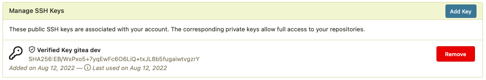

---

## Criação de token de acesso no repositório de fontes do LabQS

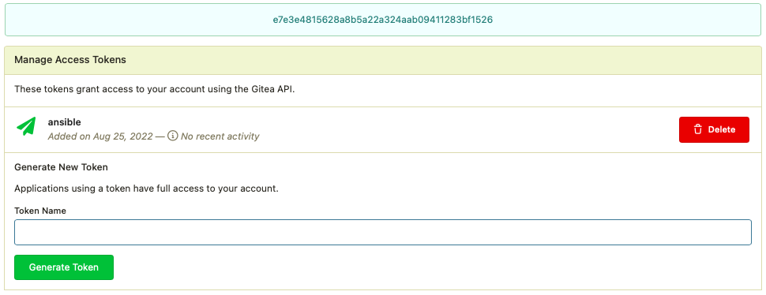

---

## Sincronizar repositorio de fontes do LabQS com repositório na nuvem

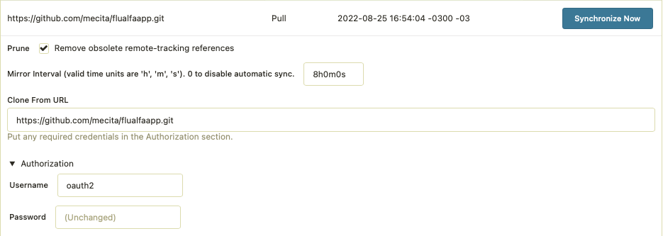

---

## Registrar o token de acesso ao repositorio de fontes do LabQS no sistema de CM

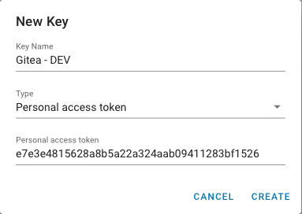

---

## Registrar o repositório e ramo do projeto no LabQS

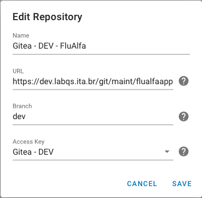

---

## Registrar os servidores onde serão feitas as instalações

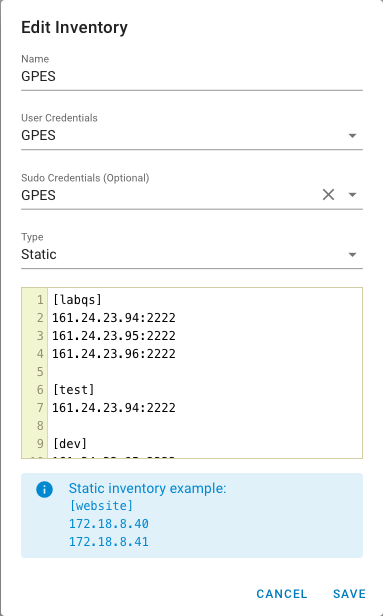

---

## Modelo de tarefa de CI/CD

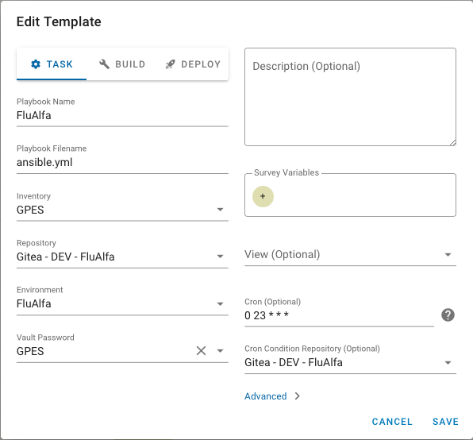

---

## Tarefa de construção

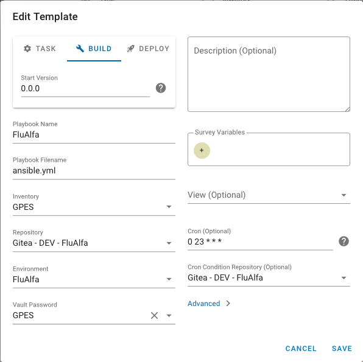

---

## Tarefa de instalação

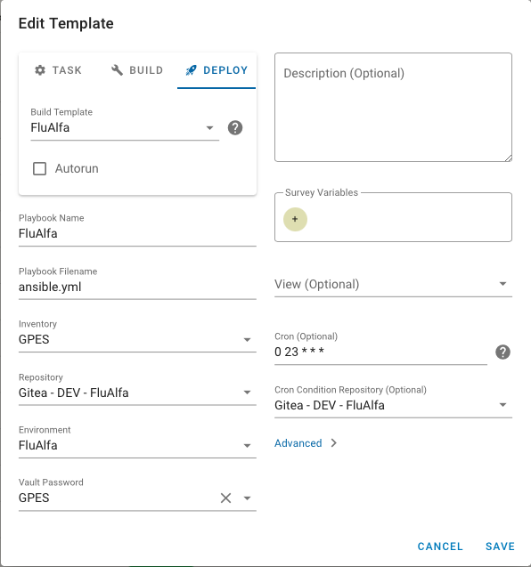

---

## Imagem da aplicação criada no servidor

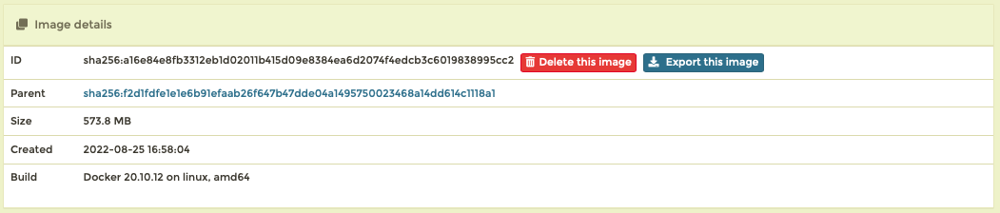

---

## Container da aplicação criado no servidor

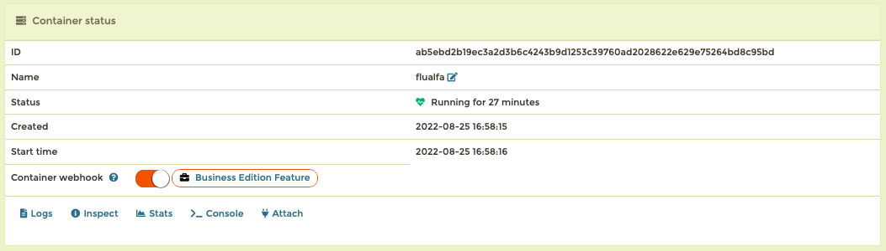

---

## Aplicação rodando no servidor

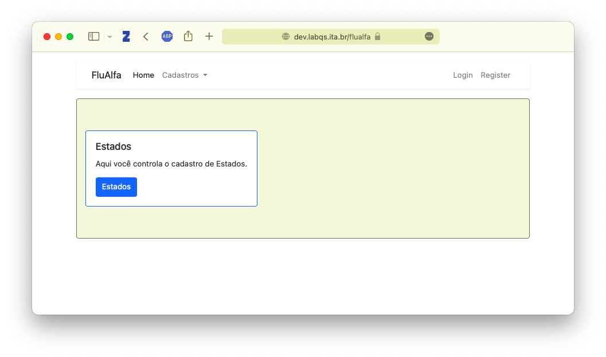

---