# Laboratório de Qualidade de Software

## Domínio de conhecimento

* _Ciência da Computação_
* _**Engenharia da Computação**_
* _Sistemas de Informação_

## Boas práticas

### Manifesto Ágil

* _**Indivíduos e interações** acima de processos e ferramentas_
* _**Software funcionando** acima de documentação completa_
* _**Colaboração do cliente** acima de negociação de contratos_
* _**Responder à mudanças** acima de seguir um plano_

## Propósito do laboratório

### Grupos de testes

* _**Acurácia** - a medida em que o resultado se aproxima do desejado, esperado ou correto_
* _**Precisão** - a variação do resultado na repetição do processo_
* _**Facilidade de uso** - atender as necessidades de quem usa_
* _**Privacidade e Segurança** - livre do uso ou divulgação indesejada, não autorizada ou imprevista da informação dos indivíduos e protegido de invasão ou sabotagem_
* _**Desempenho** - medição dos tempos de respostas em diferentes ambientes e cargas, disponibilidade e tolerância à falha_

### Tipos de testes

**Serão abordados**:

* **Funcionais**
    * _**Compatibilidade** - situação onde o uso pode ocorrer em diferentes ambientes tais como dispositivos, sistemas operacionais e navegadores_
    * _**Funcionalidade** - habilidade de executar suas funções com especificado e esperado_
    * _**Responsividade** - habilidade de responder rapidamente às tarefas demandadas e completá-las dentro de um tempo estimado como razoável dentro da expectativa do usuário_
    * _**Segurança** - extensão de proteção contra acesso não autorizado, invasão de privacidade, roubo, perda de dados, etc._
* **Não funcionais**
    * _**Concorrência** - habilidade de servir múltiplas requisições ao mesmo recurso ao mesmo tempo_
    * _**Desempenho** - velocidade na execução sob determinada carga_
    * _**Resiliência** - habilidade de executar as funcionalidades demandadas sob as condições pré-estabelecidas durante o tempo requerido sem nenhum erro_
    * _**Escalabilidade** - habilidade de aumentar ou diminuir o desempenho em resposta às mudanças nas demandas de processamento_
    * _**Estabilidade** - habilidade de permanecer estável sob diferentes cargas durante o uso_

**Não serão abordados**:

* **Funcionais**
    * _**Acessibilidade** - grau no qual pode ser usado com conforto por um amplo público, incluindo aqueles que necessitam tecnologias de assistência visual, auditiva e motora_
    * _**Localização** - habilidade ser utilizado em diferentes linguagens, fusos horários, etc._
    * _**Usabilidade** - grau de facilidade no uso_
* **Não funcionais**
    * _**Eficiência** - habilidade de executar bem e obter resultado sem desperdício de energia, recursos, esforço, tempo e dinheiro_
    * _**Facilidade de Instalar** - habilidade de ser instalado em determinado ambiente de dispositivos, sistemas operacionais e navegadores designados pela Compatibilidade_
    * _**Manutenibilidade** - facilidade de ser modificado - adição e extensão de funcionalidades, correção de erros, melhorias na eficiência_
    * _**Portabilidade** - habilidade de ser facilmente transferido de um ambiente para outro_
    * _**Testabilidade** - habilidade das funcionalidades serem facilmente verificadas e validadas_

## Implementação e uso do laboratório

A automação em estágios

### Ramos _**US000**_ do desenvolvedor

Ambiente de desenvolvimento e testes na máquina local dos desenvolvedores e inicio do primeiro estágio de integração.

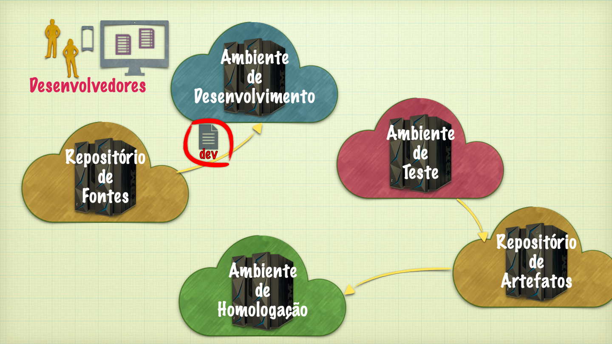

### Ramo _dev_

dev: será a origem do ambiente de testes e onde são executados testes unitários automatizados - atualizado durante a sprint ao final de cada US

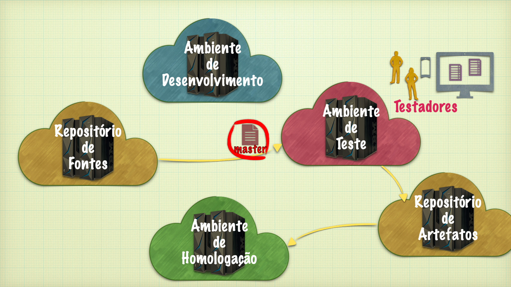

### Ramo _master/main_

Origem do ambiente de homologação e onde são executados os testes dos usuários e demais clientes - atualizado após aprovação na revisão da corrida.

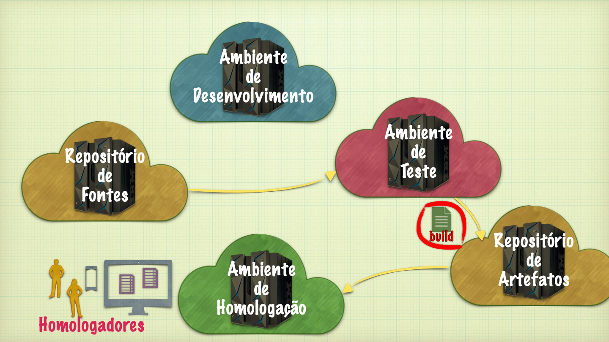


## Passo-a-passo de processo de CI/CD

---

### Repositório de fontes LabQS

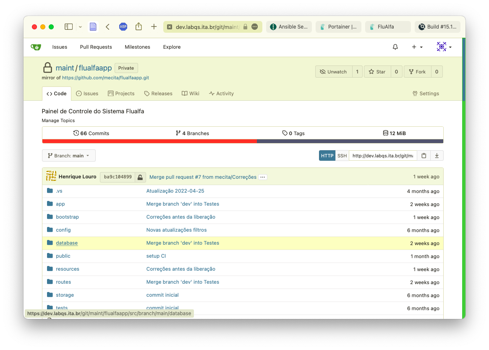

---

### Criação de chaves de acesso no repositório privado na nuvem (GitHub, GitLab, BitBucket, etc.)

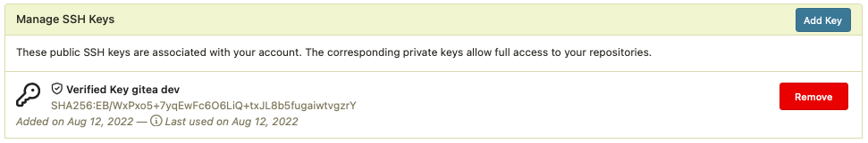

---

### Criação de token de acesso no repositório de fontes do LabQS

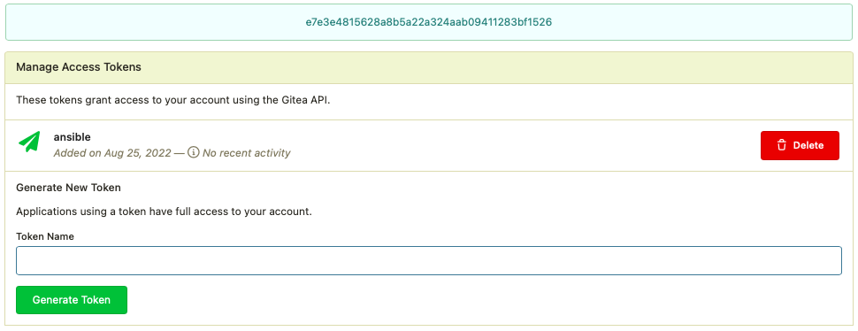

---

### Sincronizar repositorio de fontes do LabQS com repositório na nuvem

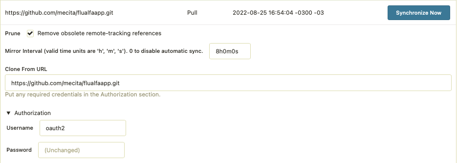

---

### Gerenciamento de configurações

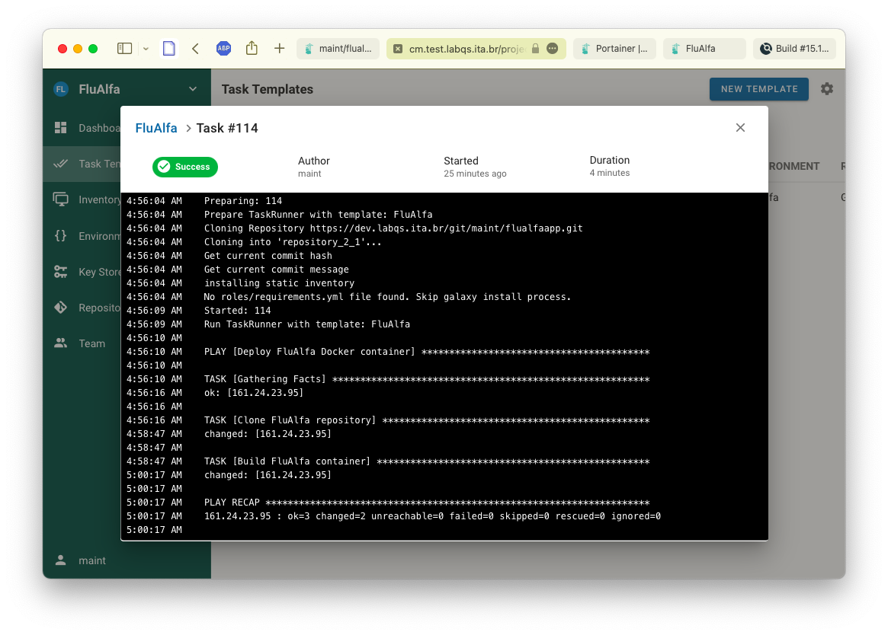

---

### Registrar o token de acesso ao repositorio de fontes do LabQS no sistema de CM

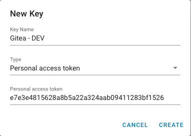

---

### Registrar o repositório e ramo do projeto no LabQS

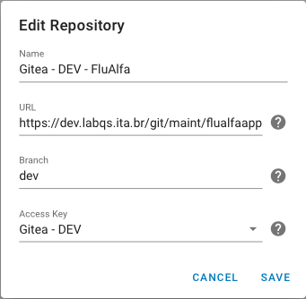

---

### Registrar os servidores onde serão feitas as instalações

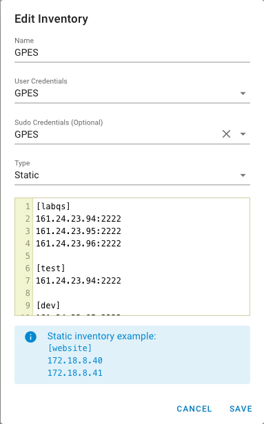

---

### Modelo de tarefa de CI/CD

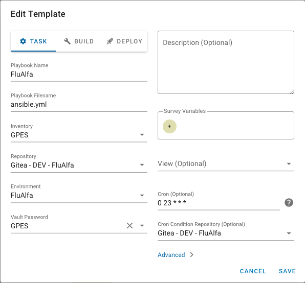

---

### Tarefa de construção

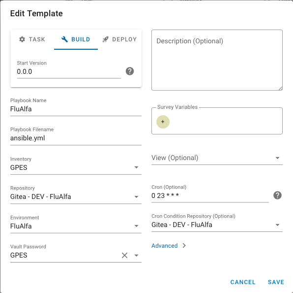

---

### Tarefa de instalação

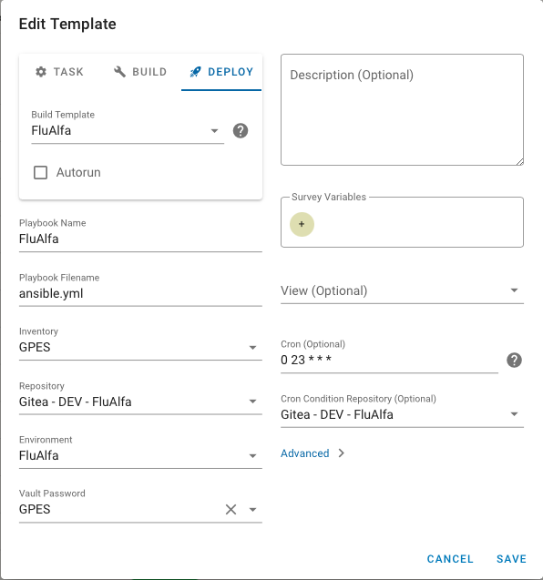

---

### Definição do processo de construção e instalação de um projeto

```yaml
- name: Deploy FluAlfa Docker container
  hosts: dev
  become: yes
  become_user: gpes
  remote_user: gpes
  tasks:
    
    - name: Clone FluAlfa repository
      copy:
        src: .
        dest: /home/gpes/flualfaapp

    - name: Build FluAlfa container
      community.docker.docker_compose:
        project_src: flualfaapp
        env_file: flualfaapp/.env.dev
        build: yes
```

---

### Descrição da imagem do container

```Dockerfile
FROM php:7.4-cli as phpbase

ENV FLUALFAAPP_PORT=10001
ENV FLUALFAAPP_HOST=172.1.100.1

RUN rm /etc/apt/preferences.d/no-debian-php

RUN apt-get update
RUN apt-get install -y wget php-cli php-zip php-pgsql unzip libpq-dev
COPY --from=composer:latest /usr/bin/composer /usr/local/bin/composer

RUN docker-php-ext-install pdo pdo_pgsql

WORKDIR /dist
COPY . /dist

RUN composer self-update
RUN composer update
RUN composer install

RUN cp .env.dev .env

RUN php artisan key:generate
# RUN php artisan migrate

RUN echo "#!/bin/sh\n" > /dist/start.sh
RUN echo "APP_ENV=dev php artisan serve --host=\$FLUALFAAPP_HOST --port=\$FLUALFAAPP_PORT\n" >> /dist/start.sh
RUN chmod +x /dist/start.sh

CMD ["/dist/start.sh"]
```

---

### Descrição do container

```yaml
services:
  flualfaapp:
    container_name: flualfa
    image: mecita/flualfaapp:${FLUALFAAPP_TAG}
    restart: unless-stopped
    stdin_open: true
    tty: true
    build:
      context: .
      dockerfile: Dockerfile
      target: phpbase
    ports:
      - "${FLUALFAAPP_PORT}:80"
    networks:
      netlab01:
        ipv4_address: "${FLUALFAAPP_HOST}"

networks:
  netlab01:
    external: true
```

---

### Gerenciador de serviços

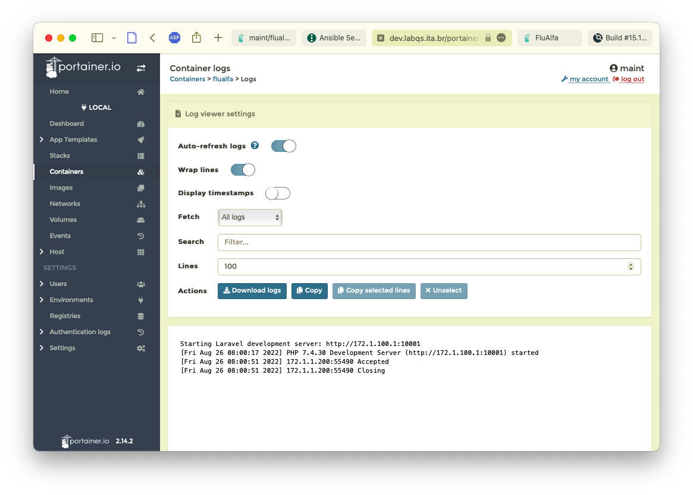

---

### Imagem da aplicação criada no servidor

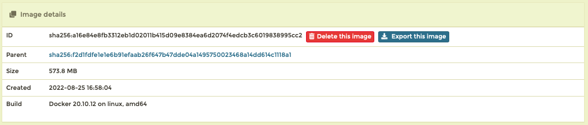

---

### Container da aplicação criado no servidor

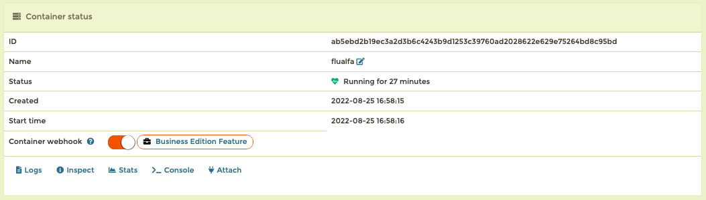

---

### Aplicação rodando no servidor

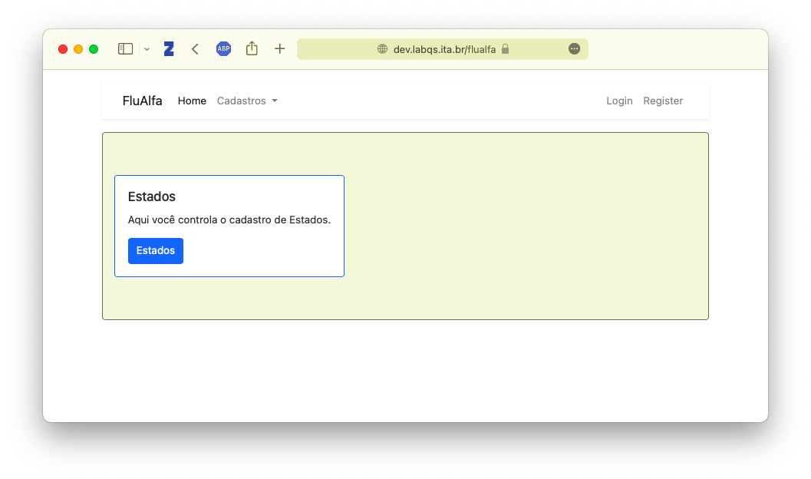

---

### Gerenciador de integração

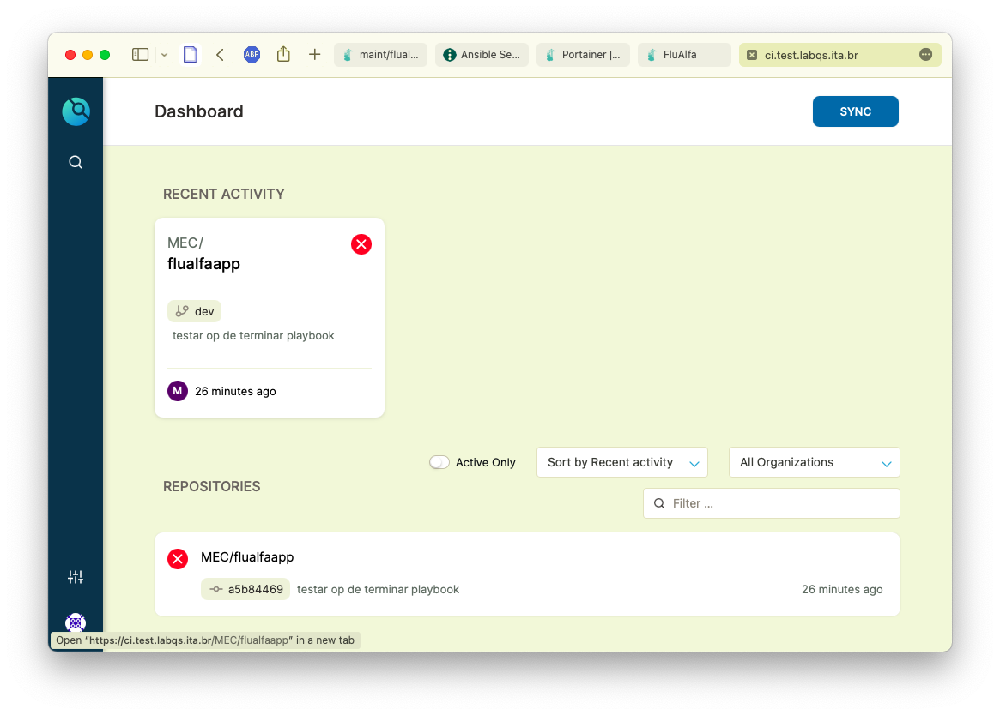

---

### Definição do processo de integração e testes

```yaml
kind: pipeline
type: docker
name: default

steps:

  - name: install
    image: composer
    commands:
    - composer install

  - name: test
    image: php:7.4-cli
    commands:
    - vendor/bin/phpunit --configuration phpunit.xml
```

---

### Instalação da aplicação na integração

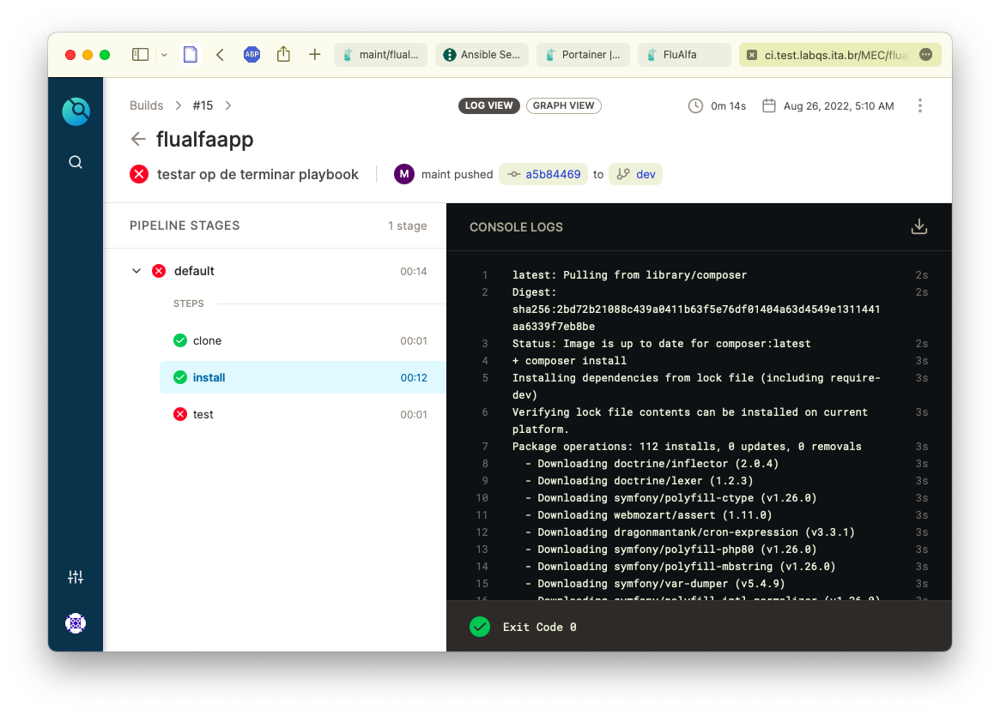

---

### Teste da aplicação na integração

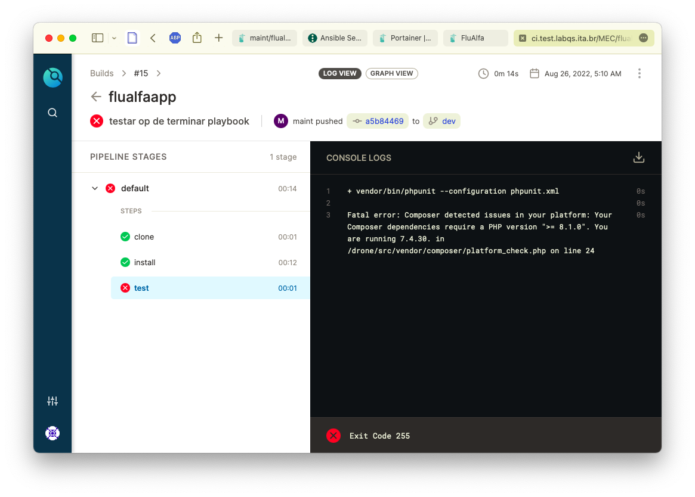

---