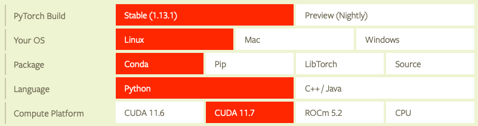

# GPU setup

## Docker

### Atualizar repositórios
```sh
apt update
```

### Instalar dependências
```sh
apt install ca-certificates curl gnupg lsb-release -y
```

### Instalar chave criptografada
```sh
mkdir -p /etc/apt/keyrings
curl -fsSL https://download.docker.com/linux/ubuntu/gpg | gpg --dearmor -o /etc/apt/keyrings/docker.gpg
```

### Obter assinatura digital
```sh
echo \
  "deb [arch=$(dpkg --print-architecture) signed-by=/etc/apt/keyrings/docker.gpg] https://download.docker.com/linux/ubuntu \
  $(lsb_release -cs) stable" | tee /etc/apt/sources.list.d/docker.list > /dev/null
```

### Atualizar repositórios
```sh
apt update
```

### Instalar Docker
```sh
apt install docker-ce docker-ce-cli containerd.io docker-compose-plugin -y
```

## GPU 

### Verificar dispositivo
```sh
lshw -C display
```

### Instalar drivers mais recentes
```sh
apt install nvidia-driver-525 nvidia-dkms-525 -y
```

### Re-iniciar
```sh
reboot
```

### Verificar dispositivo
```sh
nvidia-smi
```

### Configurar repositórios do container toolkit
```sh
distribution=$(. /etc/os-release;echo $ID$VERSION_ID) \
      && curl -fsSL https://nvidia.github.io/libnvidia-container/gpgkey | gpg --dearmor -o /usr/share/keyrings/nvidia-container-toolkit-keyring.gpg \
      && curl -s -L https://nvidia.github.io/libnvidia-container/$distribution/libnvidia-container.list | \
            sed 's#deb https://#deb [signed-by=/usr/share/keyrings/nvidia-container-toolkit-keyring.gpg] https://#g' | \
            tee /etc/apt/sources.list.d/nvidia-container-toolkit.list
```

### Atualizar repositórios
```sh
apt update
```

### Instalar container
```sh
apt install -y nvidia-docker2
```

### Re-iniciar Docker
```sh
systemctl restart docker
```

### Testar instalação
```sh
docker run --rm --gpus all nvidia/cuda:11.6.2-base-ubuntu20.04 nvidia-smi
```

## Configuração CUDA, Pytorch


