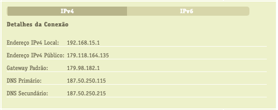
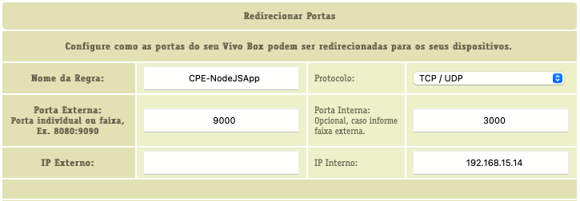

# Acessar aplicação instalada localmente num servidor remoto

## Determinar IP público

Determinar o endereço IP da sua conexão na internet usando seu roteador ou consultando algum serviço de internet que responde com seu endereço externo:



## Determinar o IP internet

Na linha de comando o IP interno pode ser obtido na lista de endereços locais do roteador:


## Habilitar conexões externas

Muitos roteadores domésticos vem com proteção para conexões externas:


## Mapear o endereço e porta da aplicação para permitir conexão externa

Independente da proteção do roteador, os provedores disabilitam a publicação de portas abaixo de 8000 nas redes domésticas, então temos que mapear a porta e o endereço IP da aplicação:



### Opção de mapear a porta

Caso a aplicação use a porta `3000`:

```javascript
    const PORT = 3000
    app.listen(PORT, () => {
        console.log(`🔥  Servidor iniciado na porta: ${PORT}`)
    })
```

## Configurar serviço apache para acessar a aplicação local

O serviço *http* já foi previamente configurado para a conexão com a máquina local do desenvolvedor. Vamos apenas documentar os procedimentos para modificações futuras.

O serviço *http* deve ser configurado corretamente para acessar a aplicação local. Antes disso o _container_ deve estar habilitado a acessar o _host_. No arquivo `stack.yaml` do serviço *htttp* deve ser adicionada a cláusula:

```yaml
    extra_hosts:
      - host.docker.internal:172.16.0.1
```

> **Obs**.: o endereço `172.16.0.1` corresponde ao _gateway_ da rede *netlab01* criada no script *create*:
> ```sh
> docker network create --driver bridge netlab01 --subnet='172.16.0.0/16'
> ```

Na configuração do serviço *http* é acrescentado o caminho para a aplicação:

```yaml
    ProxyPass /localhost http://host.docker.internal:10004
    ProxyPassReverse /localhost http://host.docker.internal:10004
```

## Configurar _host_ para redirecionar para a máquina externa partindo da porta local para a porta remota

Estas configurações devem ser feitas toda vez quem um desenvolvedor desejar conectar sua aplicação local com o servidor remoto.

No servidor remoto criar as rotas para a máquina do *desenvolvedor*. Aqui estamos usando a porta `9000` escolhida acima que será mapeada para a porta `10004` no servidor:

```sh
sudo iptables -t nat -A PREROUTING -p tcp --dport 10004 -j DNAT --to-destination 179.118.164.135:9000
sudo iptables -t nat -A OUTPUT -p tcp --dport 10004 -j DNAT --to-destination 179.118.164.135:9000
```

### Excluir o roteamento

Caso deseje alterar ou simplesmente excluir o roteamento:

#### Listar as rotas

```sh
sudo iptables -L -t nat --line-numbers
```

Identificar o número da linha das rotas em *PREROUTING* e *OUTPUT* e excluí-las:

```sh
sudo iptables -t nat -D PREROUTING 2
sudo iptables -t nat -D OUTPUT 2
```

## Testar acesso externo à aplicação local

Usando o _browser_ acessar sua aplicação local:

`http://179.118.164.135:9000`

## Testar acesso via servidor

Usando o _browser_ acessar sua aplicação remotamente:

`https://test.labqs.ita.br/localhost`

## Opção de acessar o servidor de banco de dados remoto

Caso tenha *VPN* disponível, é possível mapear o servidor Postgres e conectar a aplicação local ao banco de dados remoto. Para isto basta criar um túnel na máquina local (substituindo `<usuário_vpn>` pelo seu usuário).

> **Obs**.: a senha no servidor remoto não é a mesma da **VPN**.

```sh
ssh -p 2222 -fN -L 5432:172.16.2.201:5432 <usuário_vpn>@test.labqs.ita.br
```

> **Obs**.: Isto só funciona se a aplicação for executada sob o mesmo contexto do túnel. É possível que em alguns sistemas operacionais o contexto da linha de comando seja diferente do contexto do ambiente de execução da sua aplicação.