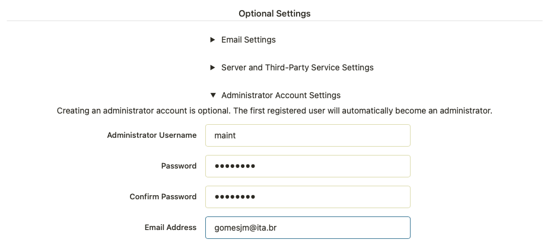
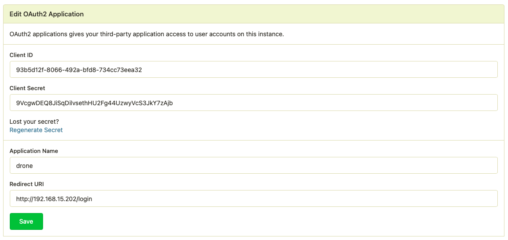
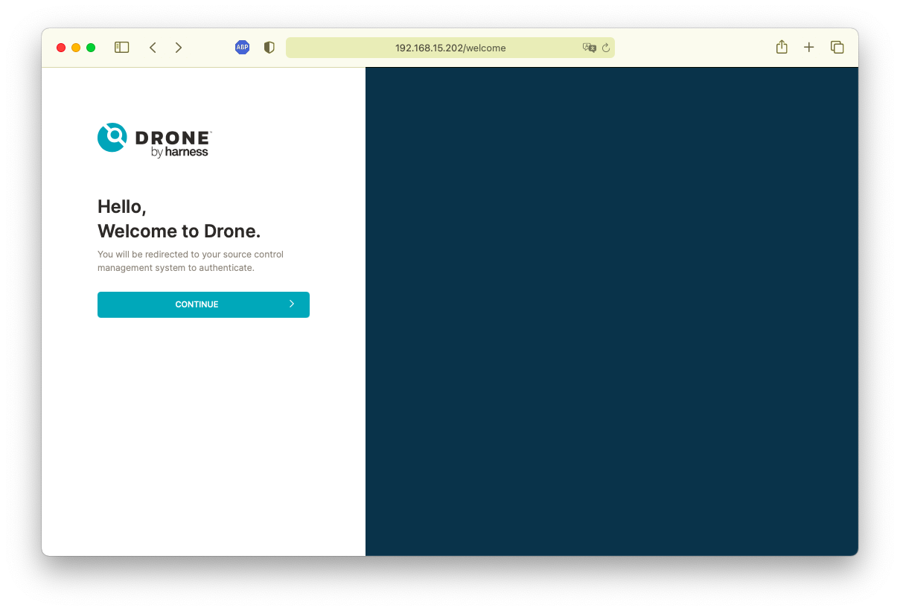
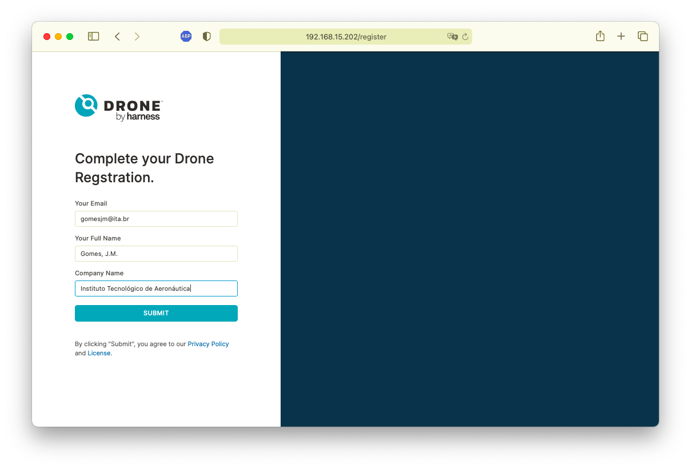
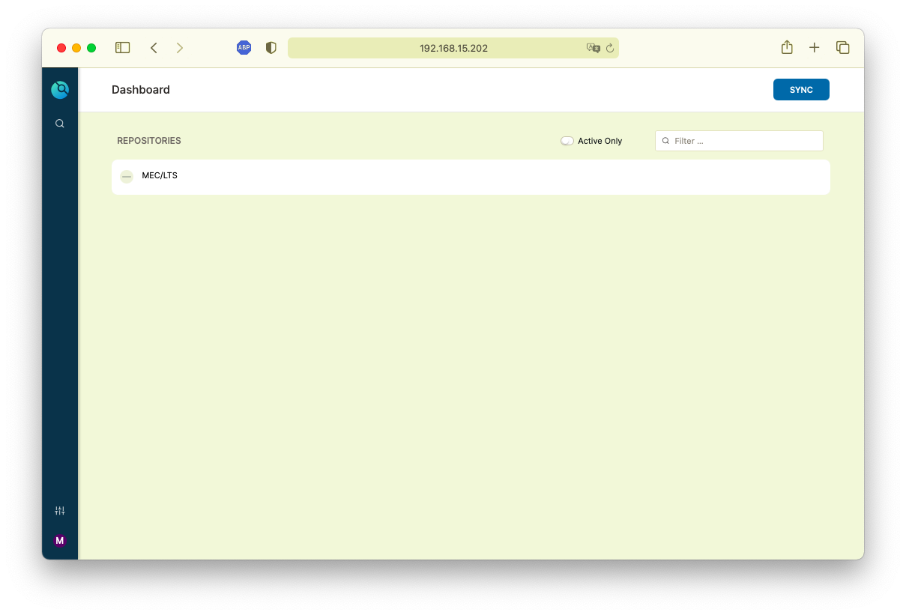
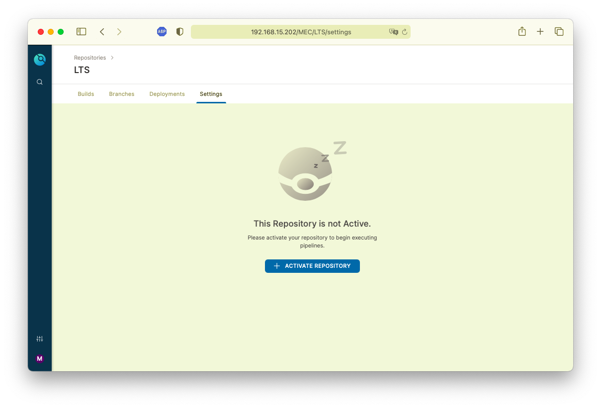
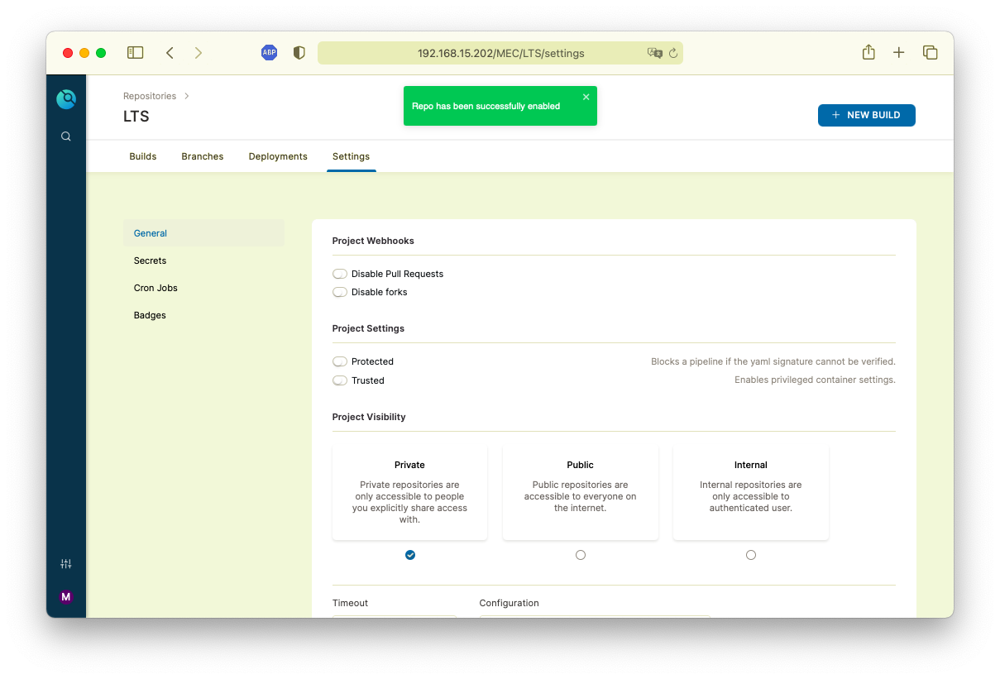
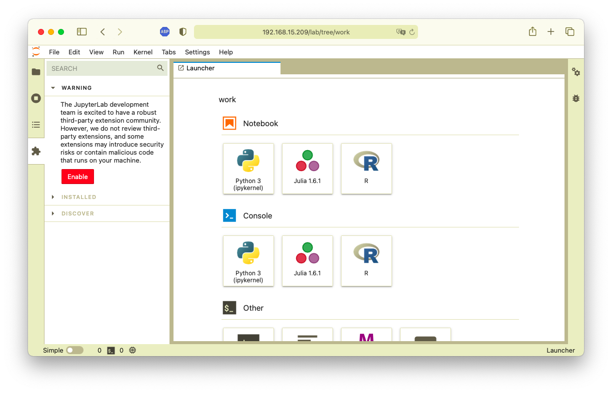
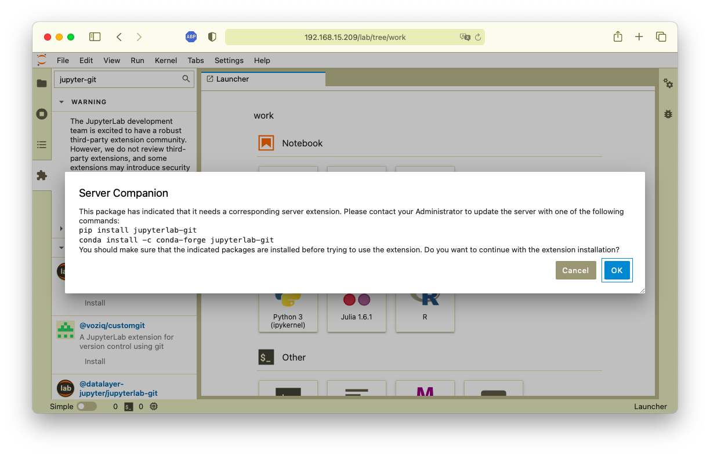
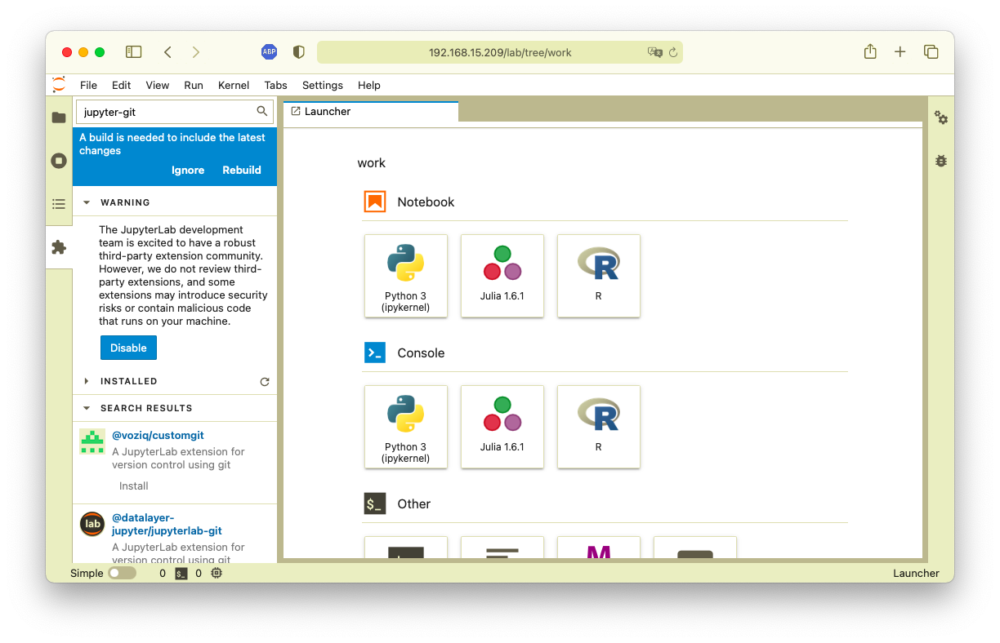

# Parâmetros de Configuração do Laboratório de Testes de Software

Cada serviço usa um arquivo `.env` que contém definições locais. Este arquivo deve ser criado na pasta de cada serviço e não é mantido sob controle de versão. Uma vez criado o serviço, o arquivo poderá ser apagado, porém observe que senhas de bancos de dados e demais serviços serão perdidas caso não sejam salvas em local seguro.

Neste documento listamos o conteúdo que pode ser encontrado no arquivo `.env` de cada serviço, com algumas chaves necessárias para configura-los corretamente em cada servidor (como endereços IP por exemplo).

Os serviços aqui são listads em ordem alfabética, porém alguns exigem uma ordem específica para serem criados. O script [setup](../common/setup) cuida disso e copia os valores exatos no arquivo `.env` de cada serviço.

---
## [`Adminer`](adminer/README.md)

```ini
SERVER_HOST=192.168.15.201
```

---
## [`Artifactory`](artifactory/README.md)
- _Ainda não configurado_

```ini
SERVER_HOST=192.168.15.201
```

---
## [`Backup`](backup/README.md)
- _Ainda não configurado_

```ini
SERVER_HOST=192.168.15.201
```

---
## [`Drone`](drone/README.md)

```ini
SERVER_HOST=192.168.15.202
GITEA_HOST=192.168.15.201
DRONE_TOKEN=bf3e1c3a4bbd191c5fc521b3e55cb69f
POSTGRES_PWD=a650dad9
GITEA_ID=93b5d12f-8066-492a-bfd8-734cc73eea32
GITEA_PWD=bJdhzMF42mjvNlRAZE1KDYmcSDykehwaFoZvtggwSYIw
SVC_PWD=f8934cbf38fce9e69b21d9e81ad30a0c
```

> **OBSERVAÇÃO**: _O "_Drone_" está instalado num servidor diferente (um endereço IP diferente) dos demais serviços. Isto acontece porque diferente dos demais serviço, o _front-end_ do "_Drone_" não funciona com _sub-path_ atrás de umm _proxy_ reverso do Apache ou do NGINX. Assim sendo o serviço está publicado num IP diferente e acessado pela porta 80 do servidor._

Após configuração do Gitea (ver abaixo), copiar os valores obtidos ao registrar a aplicação do Drone no arquivo `.env` da pasta do "_Drone_".

> **ATENÇÃO** _O serviço "Drone" deve ser recriado sempre que forem gerados novos valores para a aplicação configurada no "Gitea"._

---
## [`Gitea`](gitea/README.md)

> **ATENÇÃO**: _O serviços "_Postgres_" deve ser criado **antes** do "_Gitea_" para que o valor de autenticação da aplicação seja copiado no arquivo de configuração `.env`._

```ini
SERVER_HOST=192.168.15.201
POSTGRES_PWD=a650dad9
```

Navegar até a página de configuração do serviço (http://192.168.15.201/git) e definir a conta do administrador (no final da página, em "_Optional Settings_"):



Em seguida navegar no menu do usuário (canto superior direito) até "_Settings_" e escolher a aba "_Applications_" e criar a aplicação "_Drone_":



Os valores de "_Client ID_" e "_Client Secret_" devem ser copiados para o arquivo `.env` do "_Drone_" nas chaves `GITEA_ID` e `GITEA_PWD` respectivamente. O valor de "_Redirect URI_" deve apontar para a página `/login` do servidor externo do "_Drone_".

> O "_Gitea_" é um serviço "**Git**" similar ao "_GitHub_". Para maiores informações sobre seu uso  deverá ser consultada documentação do projeto em [**Gitea**](https://docs.gitea.io/en-us/).

---
### Configuração do "_Drone_"

> **ATENÇÃO**: _Os serviços "_Postgres_" e "_Gitea_" devem ser criados **antes** do "_Drone_" para que os valores de autenticação da aplicação sejam copiados no arquivo de configuração `.env`._

Navege até o serviço e pressione o botão "_CONTINUE_":


Informe os dados adicionais para criar a conta do usuário administrador:


Selecione o projeto que deseja colocar sob administração do "_Drone_":


Pressione o botão "_+ ACTIVATE REPOSITORY_" para colocá-lo sob o gerenciamento de Integração Contínua:


Dados adicionais de configuração poderão ser ajustados


> Para maiores informações sobre o uso do "_Drone_" deverá ser consultada documentação do projeto em [**Drone**](https://docs.drone.io/quickstart/).

---
## [`GitLab`](gitlab/README.md)
- _Inativo_

```ini
SERVER_HOST=192.168.15.201
```

---
## [`GoCD`](gocd/README.md)
- _Inativo_

```ini
SERVER_HOST=192.168.15.201
```

---
## [`HTTPD`](httpd/README.md)

```ini
SERVER_HOST=192.168.15.201
```

---
## [`JupyterLab`](jupyter/README.md)

```ini
SERVER_HOST=192.168.15.209
SVC_PWD=678da5754272c00d795671fd94f118f2b7bf534a97526c61
```

Após instalado, navergar para `http://192.168.15.209` e informar o token (variável `SVC_PWD`) via navegador.

Uma vez na página do **JupyterLab**, instalar o plugin para acesso ao Git, habilitando o acesso aos "_plugins_" e buscando por "jupyter-git":

Antes de mais nada é necessário instalar a extensão **Python** para o plugin:



Antes de mais nada é necessário instalar a extensão **Python** para o plugin:



Use o comando:

```shell
bash -c 'docker exec -it jupyter pip install jupyterlab-git'
```

Em seguida, após confirmar a instalação, será necessário reconstruir o ambiente **JupyterLab**:



> **OBSERVAÇÃO**: _A reconstrução do ambiente pode demorar. Aguarde a mensagem de que ele foi totalmente reconstruído._
>
---

---
## [`MariaDB`](mariadb/README.md)

```ini
SERVER_HOST=192.168.15.201
```

---
## [`MongoDB`](mongodb/README.md)

```ini
SERVER_HOST=192.168.15.201
SVC_PWD_01=231129cfcedf1d6c5dc1c7f1
SVC_PWD_02=6aca0ed16584ce0ca007e3f3
SVC_PWD_03=11bdce04216be4747e3e25df
```

---
## [`PostgreSQL`](postgresql/README.md)

```ini
SERVER_HOST=192.168.15.201
SVC_PWD=a650dad9
SVC_PWD_01=6abfae79
SVC_PWD_02=cdc8737e
SVC_PWD_03=e36000dc
```

---
## [`Redis`](redis/README.md)
- _Inativo_

```ini
SERVER_HOST=192.168.15.201
SVC_PWD=a4ca6741
```
---
