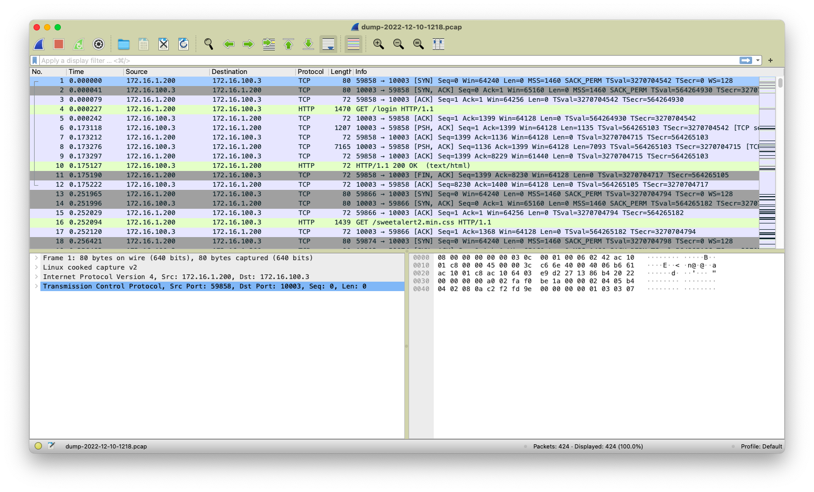

# Captura e análise de tráfego de rede de aplicação no servidor remoto

Acessar o ambiente desejado (teste, desenvolvimento, ou homologação) via VPN do ITA.

Iniciar a captura de tráfego de rede na aplicação e iniciar os textes via _browser_ (ou qualquer outro meio de comunicação utilizado para chegar na aplicação).

```sh
docker exec -it flualfagovbr tcpdump -i any -w /dist/flualfa/dump-$(date +%F-%H%M).pcap
```

Pode ser necessário também capturar o tráfego no servidor **HTTP**.

```sh
docker exec -it httpd tcpdump -i any -w /usr/local/apache2/dump-$(date +%F-%H%M).pcap
```

> **Obs**.: o servidor **HTTP** não compartilha pasta nem possui o utilitário **tcpdump** instalado
>
> ```sh
> apt-get update
> apt-get install tcpdump -y
> ```
>
> Após a captura o arquivo pode ser copiado para o servidor
>
> ```sh
> docker cp httpd:/usr/local/apache2/dump-2022-12-12-1428.pcap /export/dist/flualfa
> ```

Ao final do teste, interromper a captura e obter o arquivo gerado remotamente na pasta da aplicação vi *SFTP*.

Utilizando a sua ferramenta de análise predileta, analisar o tráfego gerado pelo teste:



> **Obs**.: para complementar pode ser interessante capturar o tráfego de rede na sua máquina local simultaneamente para poder comparar as mensagens enviadas com as recebidas pelo servidor. Isto pode ser feito diretamente pelo **Wireshark** (exemplo acima) enquanto executa a captura no servidor remoto.
