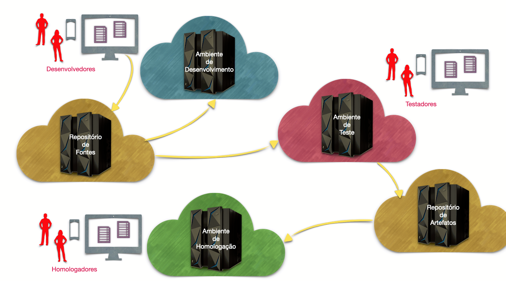
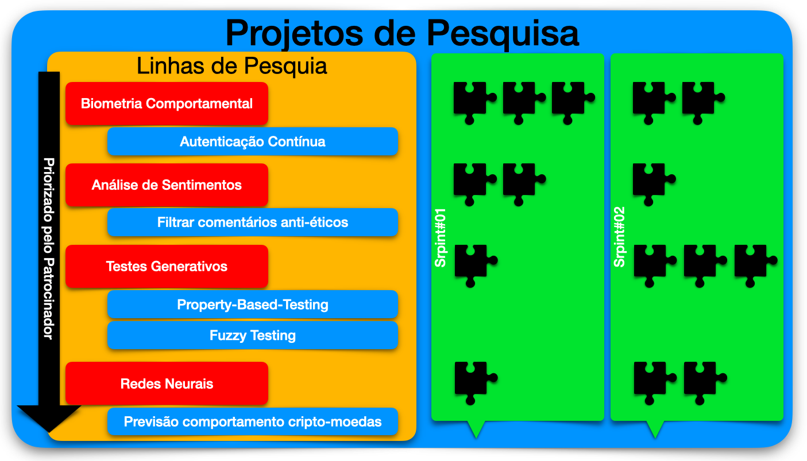

# Laboratório de Testes de Software

## Objetivos

O objetivo mais amplo do Laboratório de Testes de Software, uma iniciativa de alunos da Pós-Graduação em Engenharia Eletrônica e Computação da Divisão de Ciência da Computação no Departamento de Engenharia de Software do Instituto Tecnológico de Aeronáutica é prover a organização de um laboratório para realizar o que foi aprendido nas disciplinas de Teste de Software, Tópicos Avançados em Teste de Software, Qualidade, Confiabilidade e Segurança de Software na área de concentração de Informática em Software e Sistemas de Informação.

Em particular buscamos aplicar em Engenharia de Software conceitos gerais de Qualidade aplicados por outros segmentos da área e praticados pela indústria, sem fugir das peculiaridades e desafiso que o desenvolvimento de Software contempla.

Os preceitos de qualidade de Engenharia de Software, dos métodos ágeis de desenvolvimento de software são adotados e extendidos nesta iniciativa, que busca colocá-los em prática e permitir que alunos, professores e pesquisadores tenham em mãos ferramentas tecnológicas que permitam experimentação de métodos e processos inovadores e que possam ser revertidos em benefícios para a comunidade científica e tecnológica.

## Ambientes disponíveis

O Laboratório de Testes procura fornecer uma solução completa para alunos e pesquisadores exercitarem o fluxo de trabalho esperado durante o desenvolvimento ou manutenção de um sistema computacional complexo. Ambientes segregados de **desenvolvimento** e **testes** estão disponíveis para permiterem o exercício das atividades esperadas dos alunos na indústria. Além disto, projetos de pesquisa conduzidos por professores e pesquisadores conjuntamente com alunos de graduação e pós-graduação e que atendem demandas de inovação tecnológica sob encomenda da indústria e parceiros institucionais contam também com ambientes separados para **homologação** e **certificação** dos produtos destes projetos.

## Processos ágeis

Além disto os alunos, professores e pesquisadores aplicam técnicas consagradas pela indústria no desenvolvimento de software, perfeitamente adaptada às necessidades por projetos de pesquisa e desenvolvimento na academia.

## Configuração do laboratório

> Algumas das prospecções e atividades em andamento podem ser vistas em [Links úteis](./LINKS.md)

Instruções de instalação está em [Instalação do Laboratório](./SETUP.md).

A configuração dos serviços pode ser vista em [Configuração do Laboratório](./CONFIG.md).

Uma visão mais detalhada pode ser vista em [BUILD.md](./BUILD.md).
