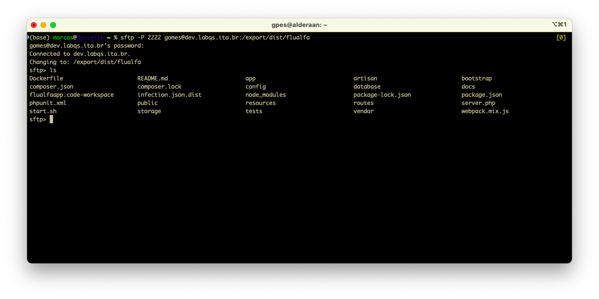

# Acessar pasta da aplicação no servidor remoto

## Configuração da aplicação

Para acessar a pasta de uma aplicação instalada no servidor remoto, é necessário instruir o processo de _deployment_ para publicar a pasta.

Para isto acrescentamos ao *Dockerfile* uma instrução para publicar um volume que será usado para compartilhar a instalação da aplicação:

```Dockerfile
VOLUME /dist/flualfa
```

O processo de _build_ da aplicação prossegue utilizando outra pasta (não é possível construir e compartilhar a mesma pasta, pois o _container_ não tem acesso à pasta que será exposta durante sua formação):

```Dockerfile
WORKDIR /build/flualfa
COPY . /build/flualfa
```

Via **ansible** a imagem é criada preparando o conteúdo na pasta `/build`:

```Dockerfile
RUN composer self-update
RUN composer update
RUN npm install
RUN composer install
```

```yaml
build:
                context: ${HOME}/flualfa
                dockerfile: Dockerfile
                target: phpbase
                args:
                  FLUALFAAPP_HOST: ${FLUALFAAPP_HOST}
                  FLUALFAAPP_PORT: ${FLUALFAAPP_PORT}
                  VERSION: '{{ semaphore_vars.task_details.target_version }}'
```

O container deve ser configurado por um script de inicialização:

```Dockerfile
RUN chmod +x /build/flualfa/start.sh

CMD ["/build/flualfa/start.sh"]
```

E mais tarde o container é criado exportando a pasta compartilhada num ponto local do servidor _host_:

```yaml
              volumes:
                - /export/dist/flualfa:/dist/flualfa
```
_Esta configuração reside num arquivo que será processado via **docker compose** pelo script **ansible**_

Durante a inicialização do container o script `start.sh` irá copiar o conteúdo produzido pela criação da imagem para a pasta inicializada durante a criação do container, mudar para a pasta compartilhada e executar a inicialização da aplicação:

```sh
shopt -s extglob
cp -r /build/flualfa/* /dist/flualfa
cp -r /build/flualfa/.!(@(|.)) /dist/flualfa

cd /dist/flualfa

echo "Versão: $VERSION"
sed -i 's/APP_BUILD=00000/APP_BUILD='$VERSION'/g' .env

php artisan key:generate
php artisan migrate
npm run dev
php artisan route:clear
php artisan serve --host=$FLUALFAAPP_HOST --port=$FLUALFAAPP_PORT

echo "exited $0"
```

## Acesso via **VPN**

A pasta publicada no _host_ externo via configuração da criação do container poderá ser acessada via VPN:

```yaml
              volumes:
                - /export/dist/flualfa:/dist/flualfa
```

```sh
sftp -P 2222 <usuario no servidor dev>@dev.labqs.ita.br:/export/dist/flualfa
```

```sh
mkdir -p /mnt/dev.labqs
sudo mount -t nfs dev.labqs.ita.br:/export /mnt/dev.labqs
```

> **Obs**.: a senha no servidor remoto não é a mesma da **VPN**.


