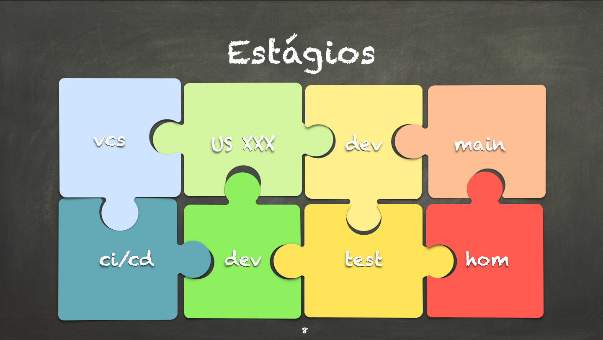
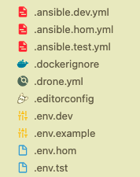
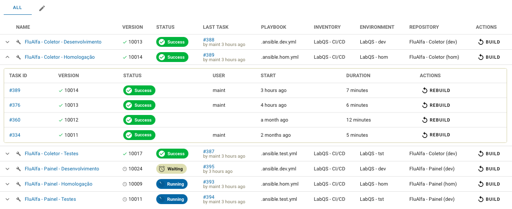
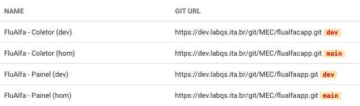
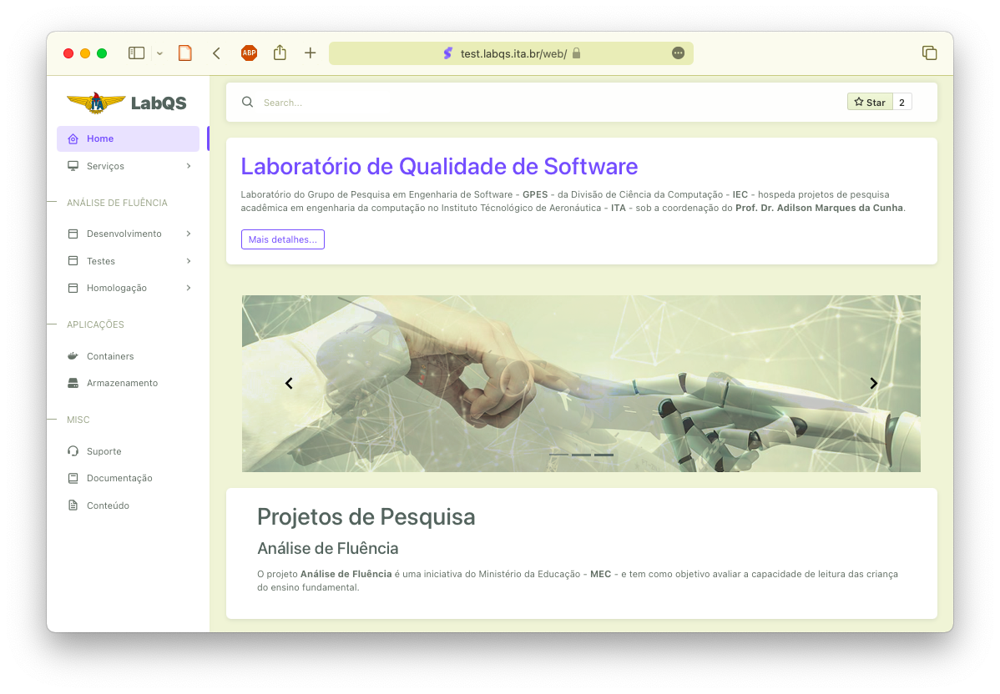
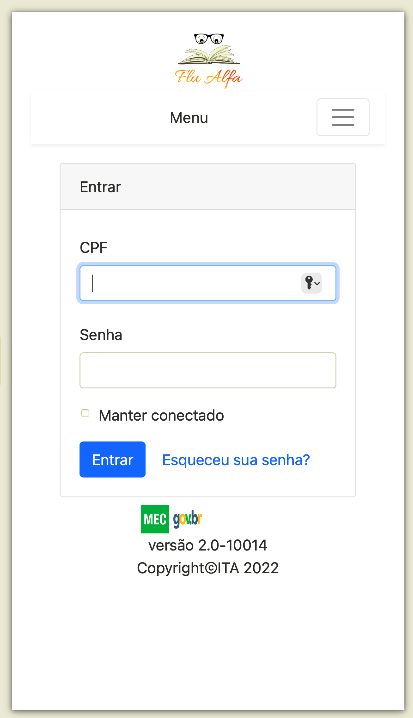

# Estágios de Desenvolvimento

Com a implantação dos diferentes ambientes de [desenvolvimento](https://dev.labqs.ita.br), [testes](https://test.labqs.ita.br) e [homologação](https://labqs.ita.br), implantamos um processo de integração usando diferentes estágios e aproveitando o controle de versionamento.

Este processo utiliza arquivos de configuração que foram documentados para o [Laboratório de Qualidade de Software](./BUILD.md).

Optamos por ter configurações diferentes para cada ambiente apesar de serem praticamente idênticas atualmente.

Algumas observações sobre o processo de construção e instalação das aplicações:

1. Existe uma tarefa (_task_) para cada projeto e cada ambiente (num total de *3* tarefas por projeto);
2. Cada ambiente aponta para um repositório de fontes específico e determina o ramo do fonte que será utilizado
    - ramos `USXXX` para o ambiente de [desenvolvimento](https://dev.labqs.ita.br) ou `dev` quando não houver US em aberto;
    - ramo `dev` para o ambiente de [testes](https://test.labqs.ita.br) (reflete todos os ramos `USXXX` da corrida passada); e
    - ramo `main` para o ambiente de [homologação](https://labqs.ita.br) (reflete o ramo `dev` após os testes).
3. A versão é independente por ambiente e por aplicação:
    - no exemplo acima, a versão `10013` do coletor no ambiente de [homologação](https://labqs.ita.br) não está relacionada à versão `10013` do coletor no ambiente de [desenvolvimento](https://dev.labqs.ita.br).
4. Podemos observar abaixo a lista de repositórios utilizada pelo processo de construção e instalação
5. Deve ser criado um repositório específico para uma `USXXX` quando desejada a instalação e construção deste ramo no ambiente de [desenvolvimento](https://dev.labqs.ita.br)

Uma vez instaladas, as aplicações do projeto podem ser acessadas via portal:

1. Testes: https://test.labqs.ita.br/mec
2. Desenvolvimento: https://dev.labqs.ita.br/mec
3. Homologação: https://labqs.ita.br/mec

Uma vez acionada a aplicação, a *versão* listada pelo aplicativo do processo de construção & instalação é apresentada na tela - no exemplo abaixo, o coletor apresenta a versão `10014` no ambiente de *Homologação* que corresponde à versão listada acima.

