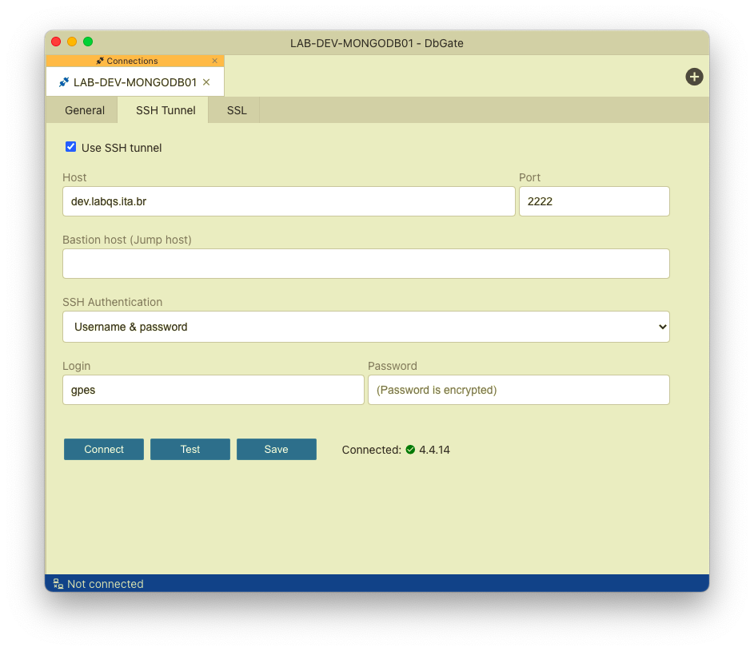

# Como utilizar os servidores do laboratório

## Via linha de comando

Uma vez conectada à VPN do laboratório, é possível usar um túnel SSH para acessar os serviços do laboratório, como os de bancos de dados por exemplo:

### Postgres
```bash
ssh -fN -L 5432:172.1.2.201:5432 <usuario da vpn>@dev.labqs.ita.br -p 2222
```

### Redis
```bash
ssh -fN -L 6379:172.1.7.201:6379 <usuario da vpn>@dev.labqs.ita.br -p 2222
```

### MongoDB
```bash
ssh -fN -L 27017:172.1.8.201:27017 <usuario da vpn>@dev.labqs.ita.br -p 2222
```

### MariaDB
```bash
ssh -fN -L 3306:172.1.9.201:3306 <usuario da vpn>@dev.labqs.ita.br -p 2222
```

Uma vez conectado o túnel SSH podemos conectar o serviço remoto como se estivesse instalado localmente. Por exemplo, abrir a conexão com servidor Postgres tunelado acima:

```bash
telnet localhost 5432
Trying ::1...
Connected to localhost.
Escape character is '^]'.
^]
telnet> quit
Connection closed.
```

## Via código

Uma vez conectada à VPN do laboratório, é possível usar um túnel SSH para acessar os serviços do laboratório via código, como os de bancos de dados por exemplo:

```python
import csv
import redis
from sshtunnel import SSHTunnelForwarder

import decouple

config = decouple.AutoConfig(' ')
gpes_redis01_password = config('GPES_REDIS01_PASSWORD')
gpes_ssh_password = config('SSH_PASSWORD')

server = SSHTunnelForwarder(
    ('dev.labqs.ita.br', 2222),
    ssh_username = '<usuario da vpn>',
    ssh_password = gpes_ssh_password,
    remote_bind_address = ('172.1.7.201', 6379))

server.start()

r = redis.Redis(host = server.local_bind_host, port = server.local_bind_port, password = gpes_redis01_password)

server.stop()
```

## Via aplicativo

Uma vez conectada à VPN do laboratório, é possível usar um túnel SSH para acessar os serviços do laboratório dentro de uma aplicação (disponível em algumas), como os de bancos de dados por exemplo:

