# Inclusão de projetos no processo de Integração Contínua

## Replicação de um projeto no repositório do Laboratório

Copiar a URL do projeto no repositório externo:

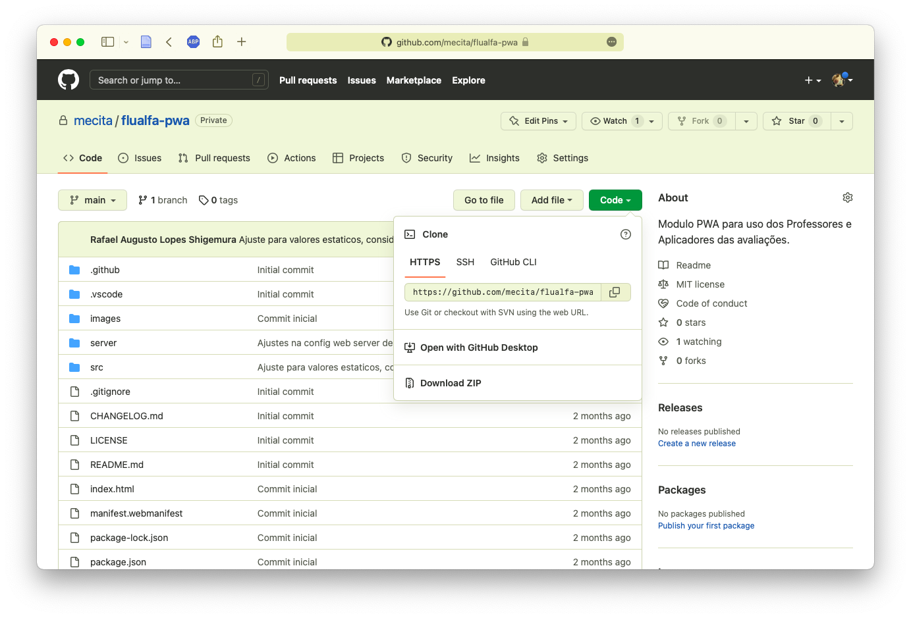

---

No repositório da organização no Controle de Fontes do laboratório escolher a opção "New Migration":

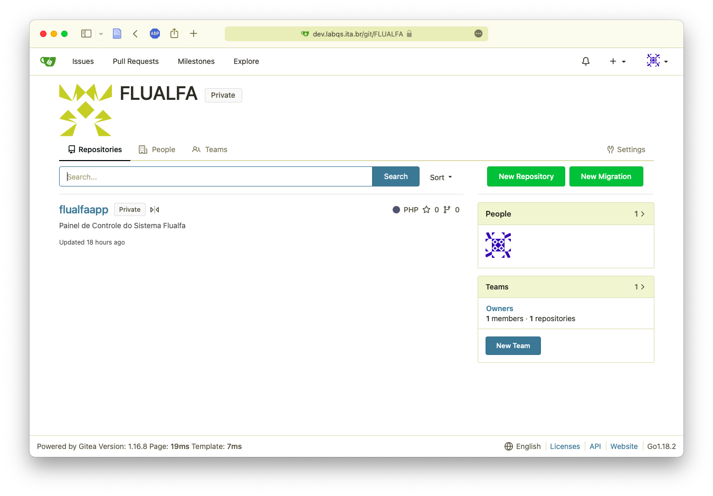

---

Iniciar a migração para o tipo correspondente de repositório externo (GitHub, GitLab, Bitbucket, etc.) e informar a URL anotada no passo anterior:

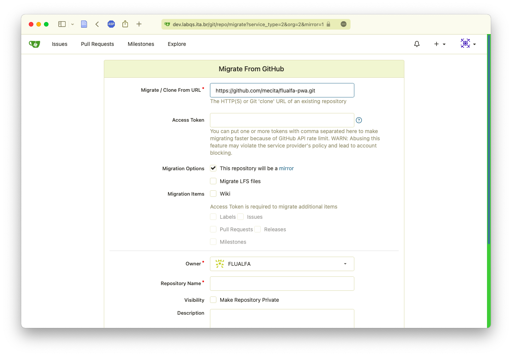

---

Informar o "Personal Access Token" criado no repositório externo (instruções de como fazê-lo deve ser obtida na documentação do serviço externo):

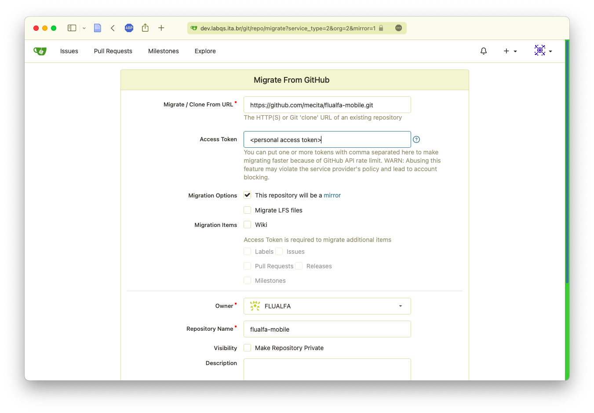

---

Recomendamos tornar o repositório "Privado" e iniciar a migração com a opção "Migrate Repository":

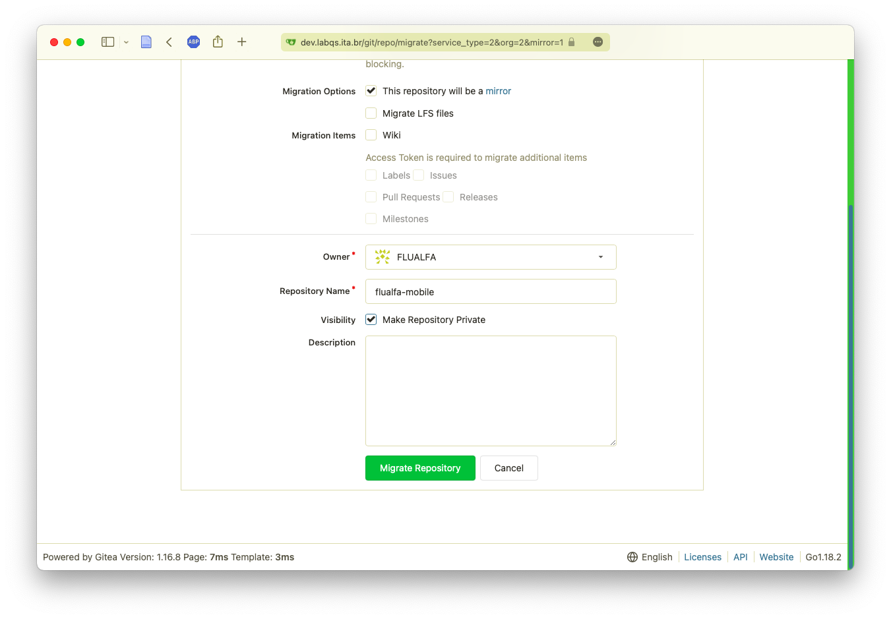

---

Uma vez migrado o repositório será replicado periodicamente no serviço de fontes do Laboratório:

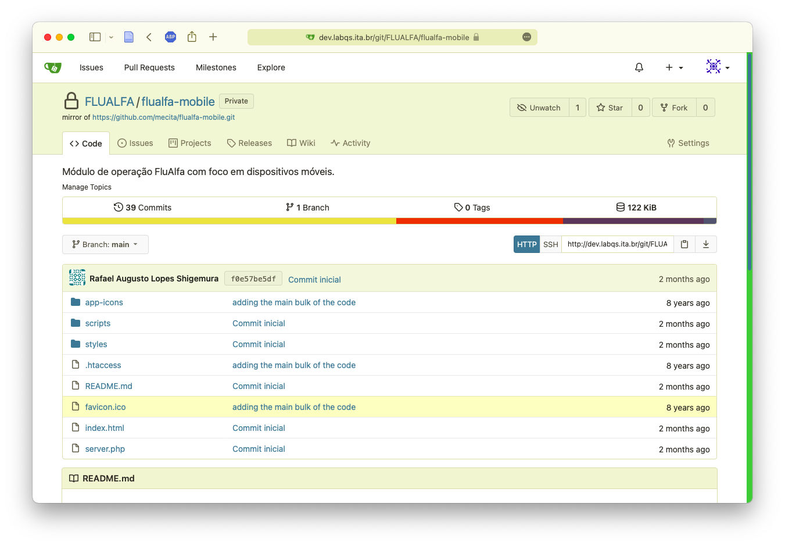

---

Recomendamos também ajustar o período de sincronização para 1h:

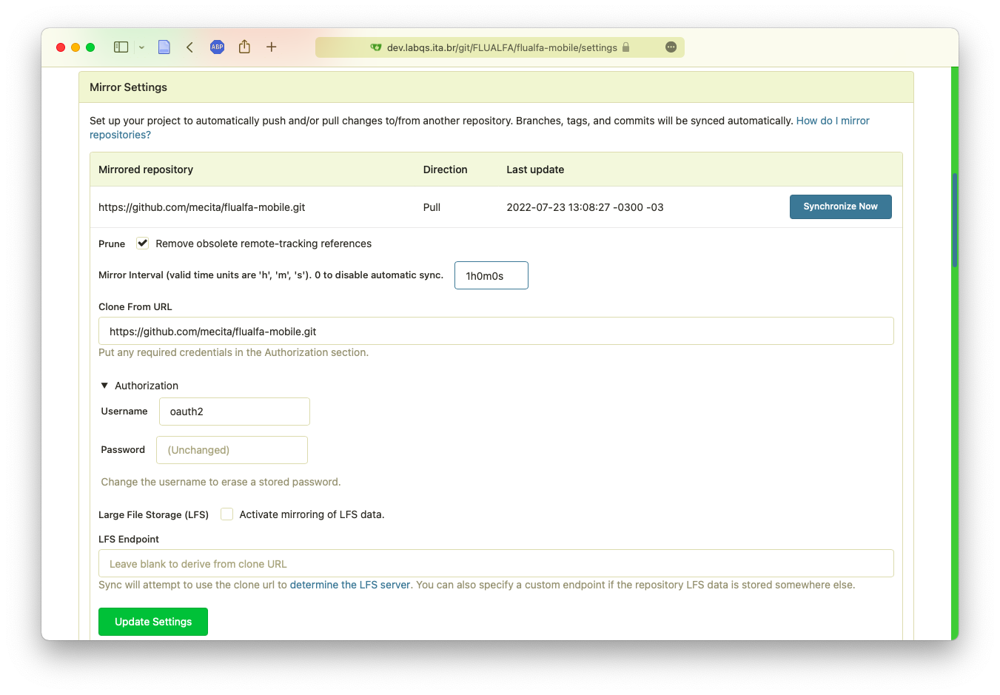

---

Uma vez migrado o repositório para o serviço de fontes, devemos sincronizar o serviço de integração contínua com a opção "Sync":

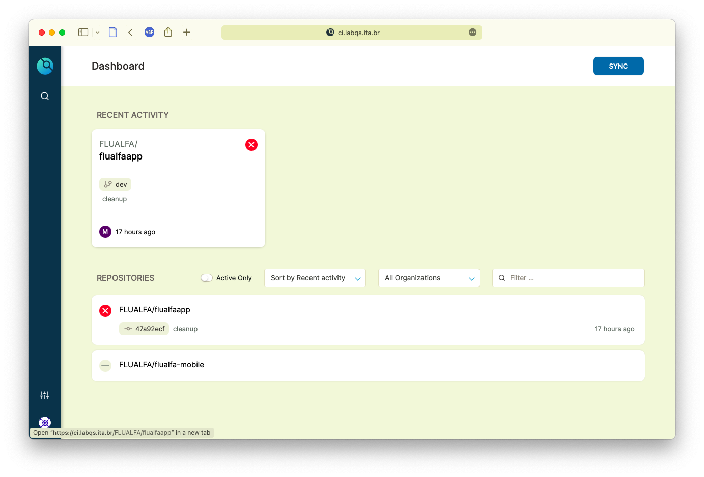

---

Uma vez sincronizado, o novo repositório poderá ser ativado:

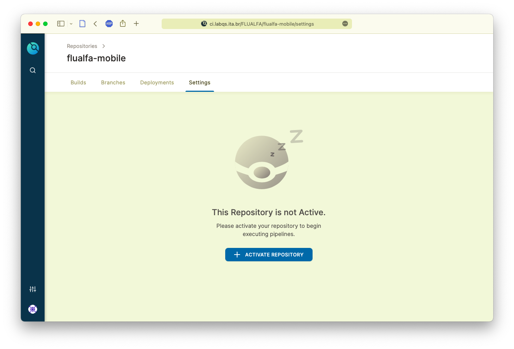

---

Podemos então adicionar um novo "build":

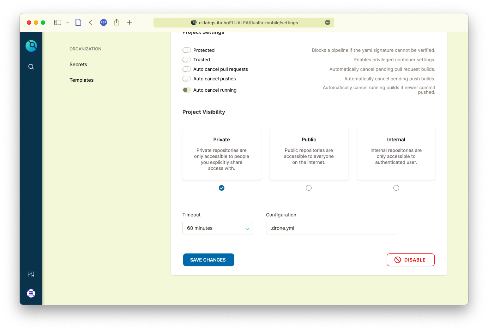

---

Devemos especificar um dos ramos de fontes (no exemplo o ramo "dev"):

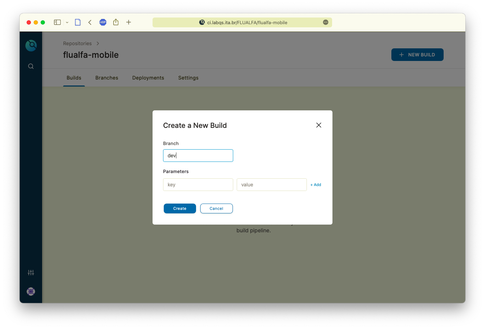

---

Uma vez inserido, o novo "build" irá ser processado

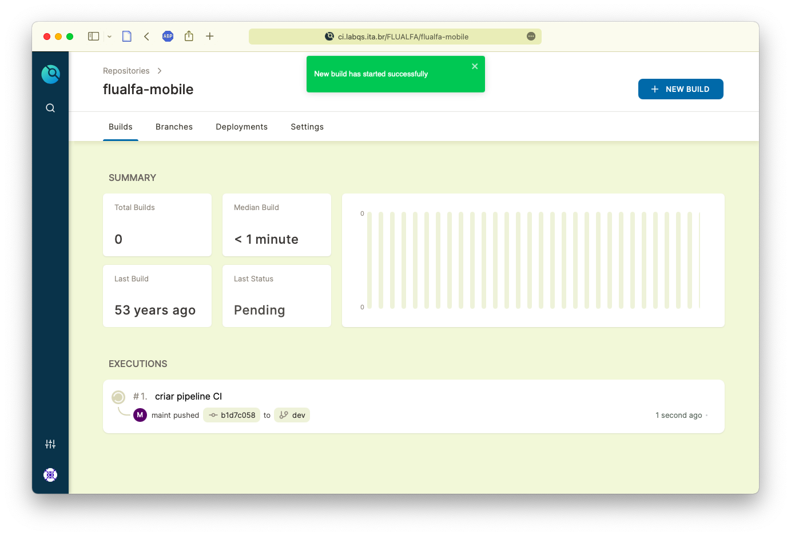

---

Poderemos observar o progresso do "build":

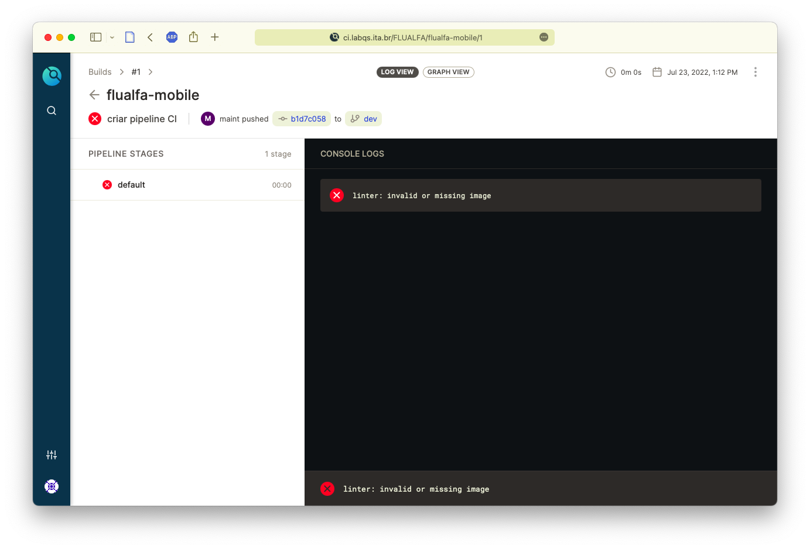

---

O erro apresentado foi causado pela falta de uma imagem "Docker" na especificação da [`Pipeline`](PIPELINE.md) "pipeline" de processamento do "build":

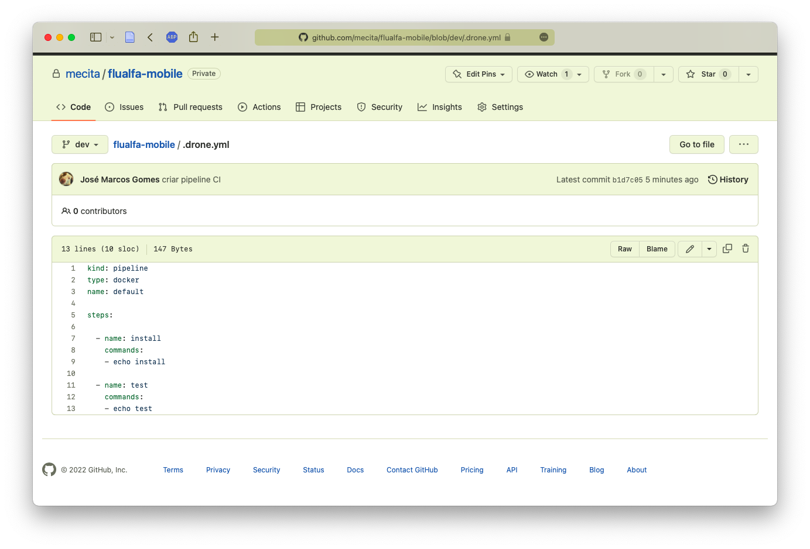

---