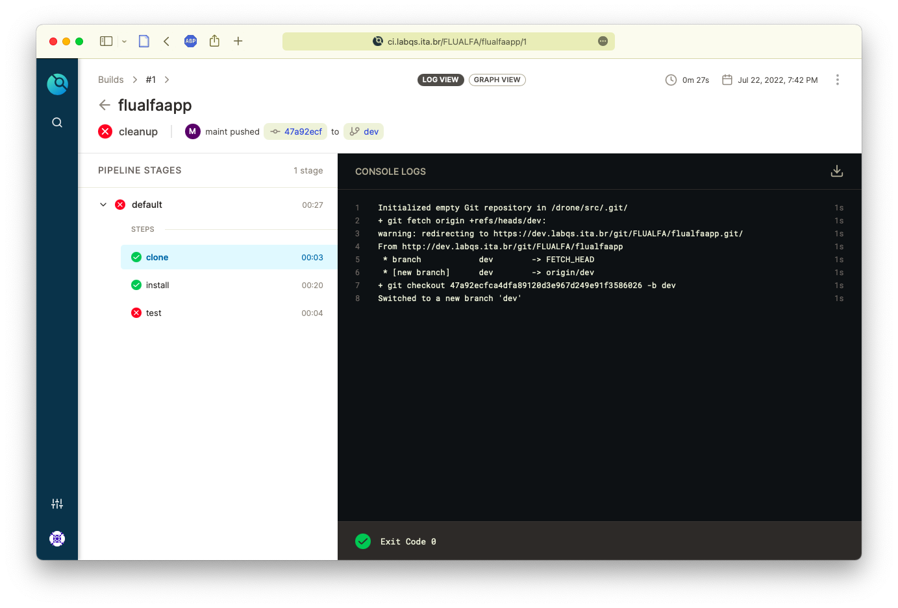
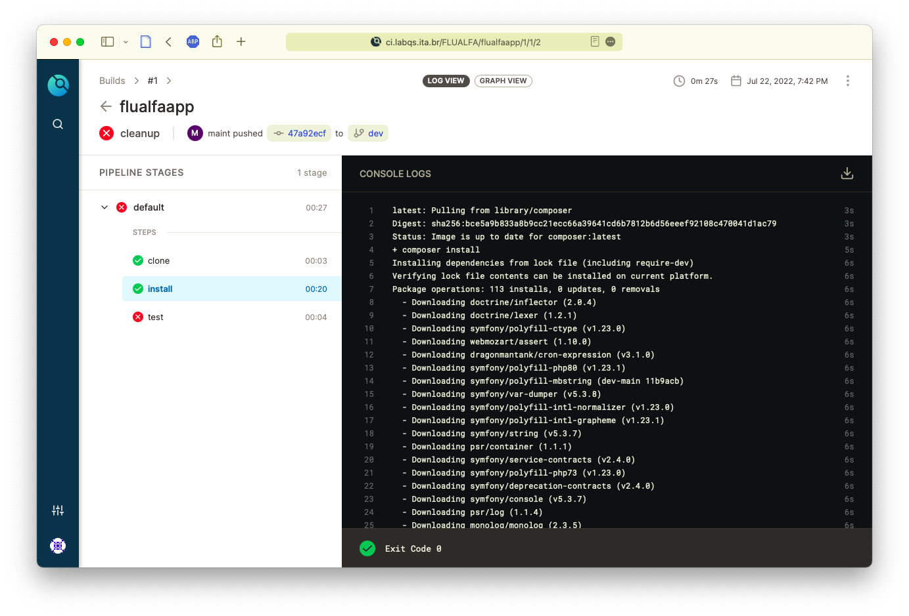
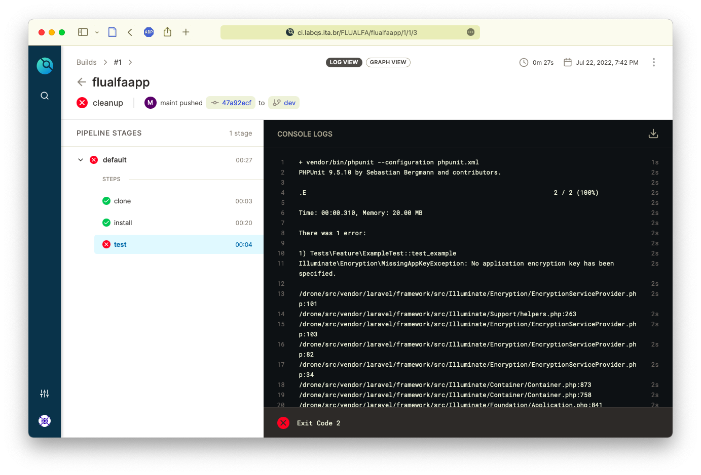

# Configuração da Pipeline de processamento da Integração Contínua

## Arquivo `.drone.yml`

Para ser ativado corretamente devemos adicionar o arquivo de configuração `.drone.yml` na raiz do projeto.

A documentação para o arquivo pode ser encontrada no site do projeto [`Drone.io`](https://docs.drone.io/pipeline/overview/) 


```yml
kind: pipeline
type: docker
name: default

steps:

  - name: install
    image: composer
    commands:
    - composer install

  - name: test
    image: php:7
    commands:
    - vendor/bin/phpunit --configuration phpunit.xml
```

No exemplo acima criamos imagens "Docker" para fazer a instalação de um projeto `PHP` e executar o teste unitário.

Podemos ver no primeiro passo (intríseco para todo "build") que o repositório de fontes é clonado no servidor de integração contínua:



---

Em seguida é executado o primeiro passo (denominado _install_) que irá instanciar um "container Docker" e executar o comando especificado:



Uma vez bem sucedido o passo anterior, no passo seguinte serão executados testes unitários (utilizando _phpunit_) e a configuração do projeto:

