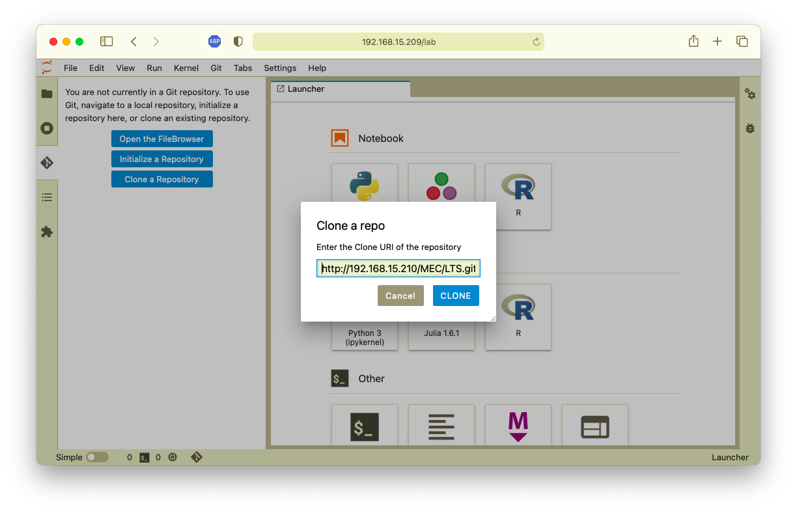
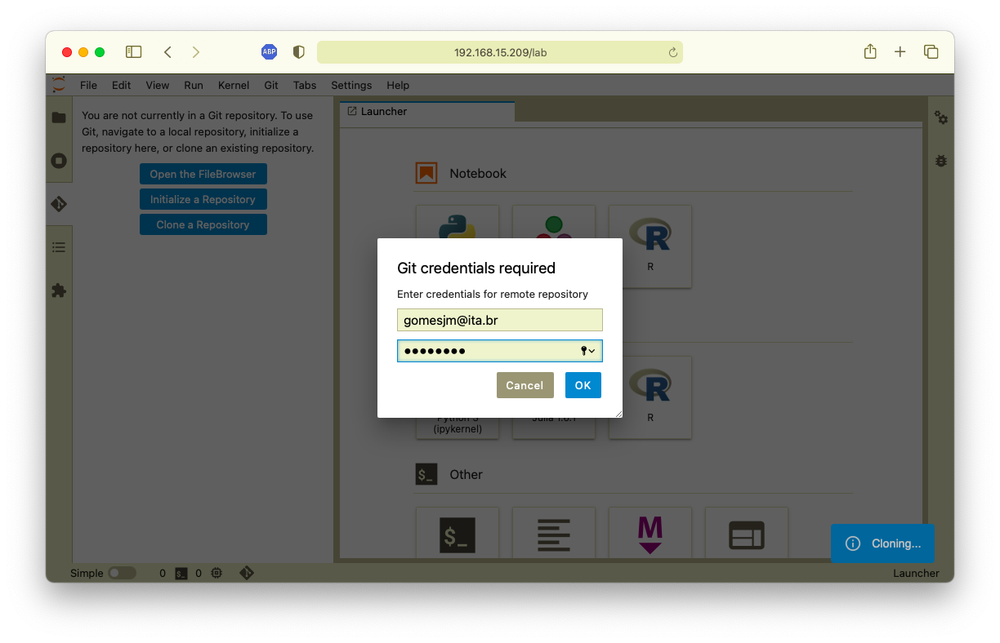
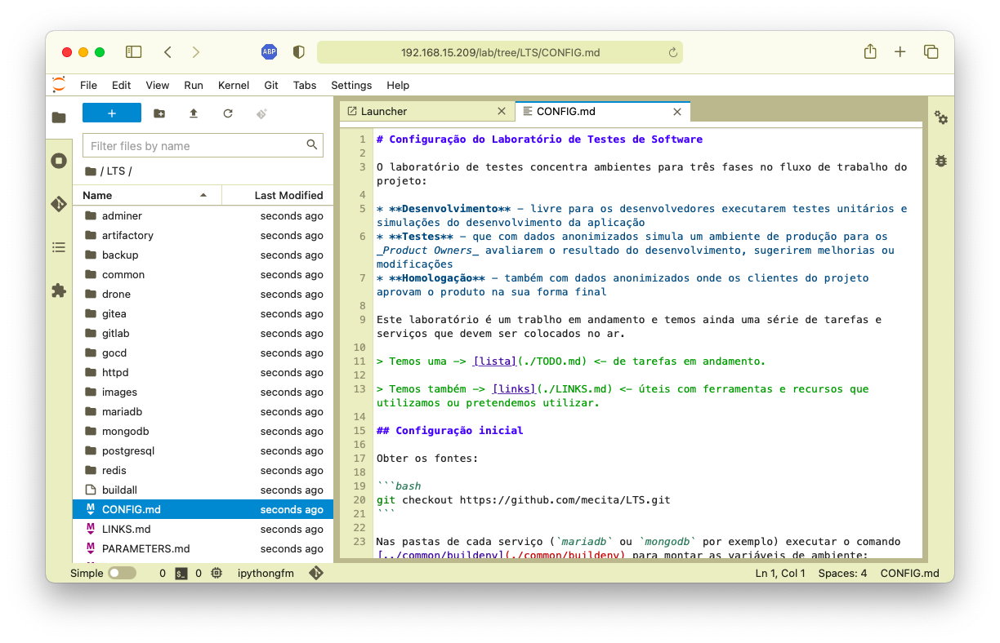
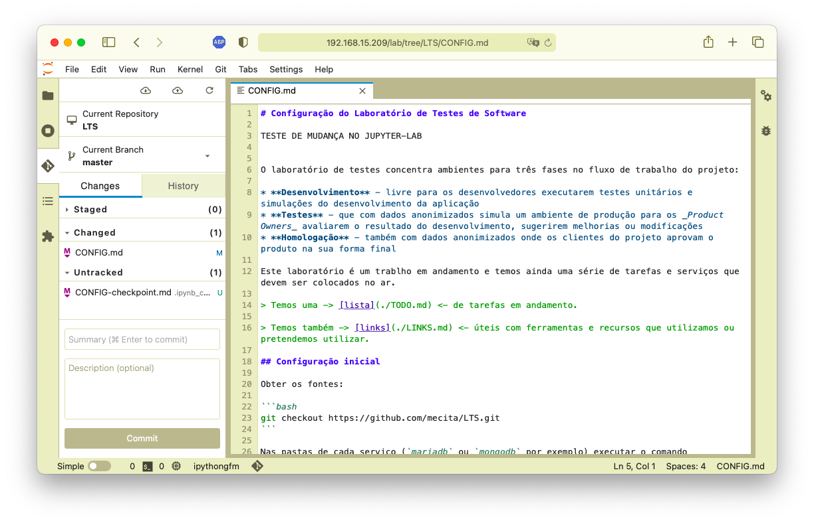
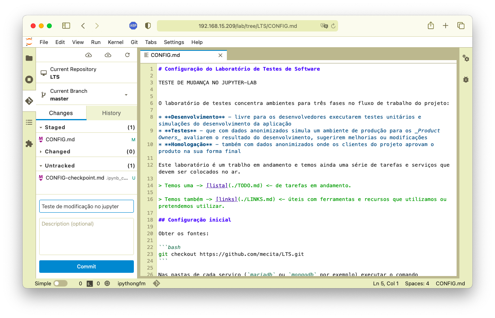
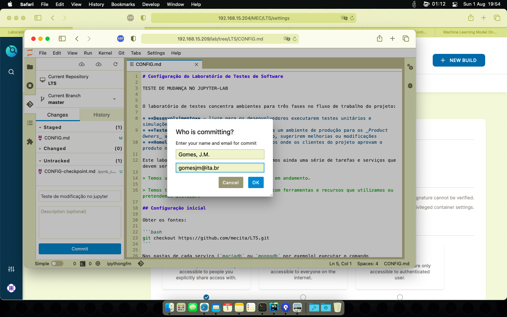
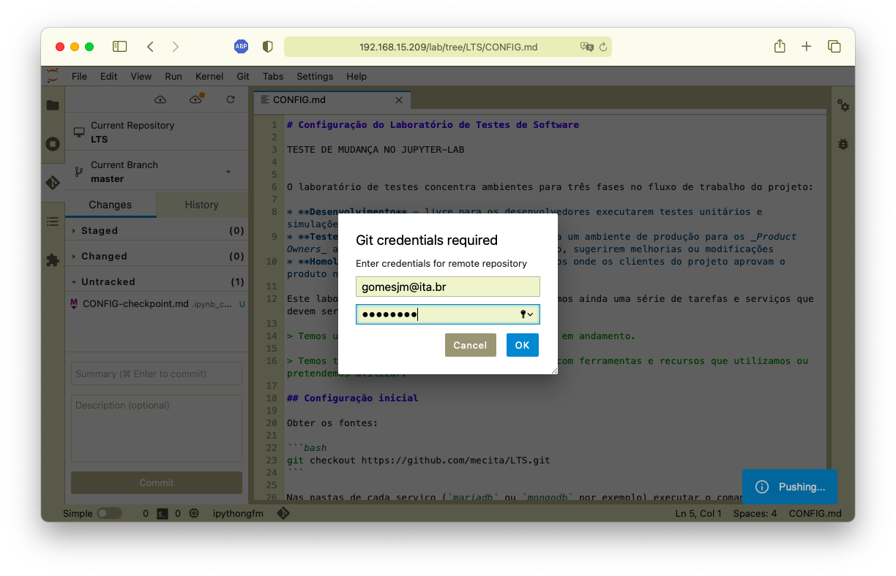
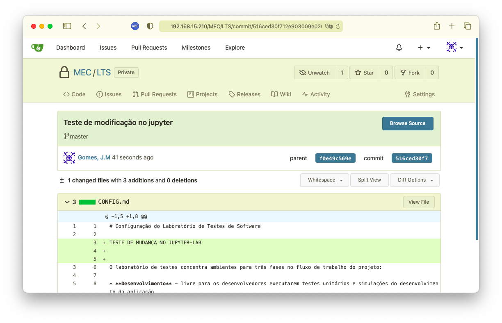

# Serviço JupyterLab

## Git

O serviço **JupyterLab** possui um _plugin_ **Git** com o qual é possível acessar os projetos no repositório de fontes do Laboratório.

Basta acessar o plugin na barra de ferramentas e informar o repositório desejado:

Informar as credenciais:

E usar o repositório dentro do **JupyterLab**:

Acrescentar os arquivos que foram modificados (na aba "_Changed_") para publicação no repositório de fontes:

Uma vez selecionados e movidos para publicação (aba "_Staged_") informar uma mensagem e selecionar o botão "_Commit_":

Pode ser necessário identificar o usuário para documentar as modificações feitas:

E em seguida serão solicitadas as credenciais:

A atualização feita no repositório de fontes Pode ser observada a atualização feita no repositório pode ser observada no serviço de fontes:

## LaTeX

