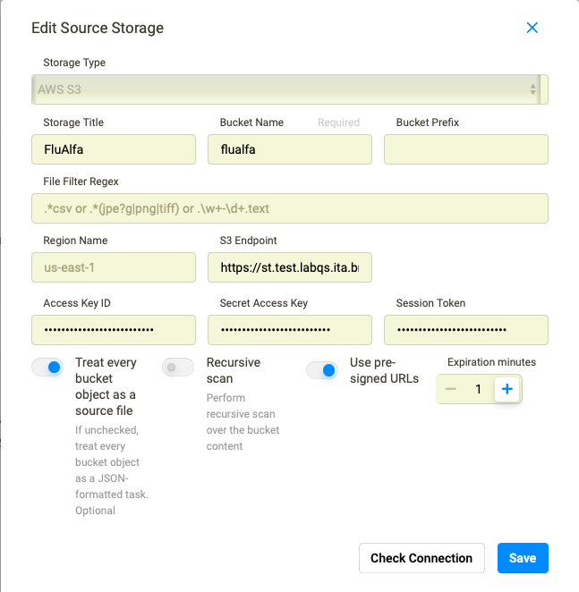
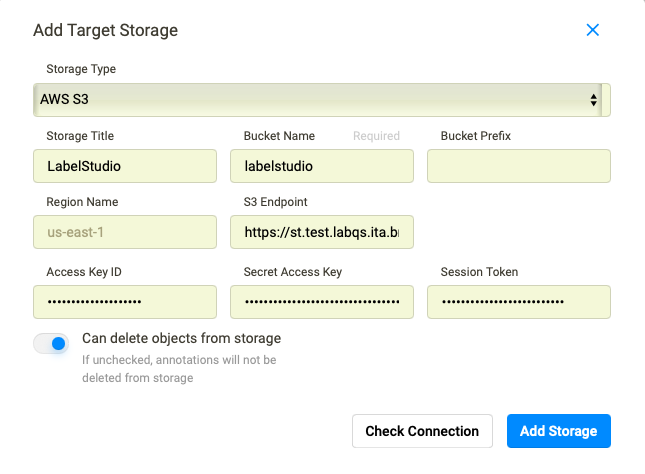
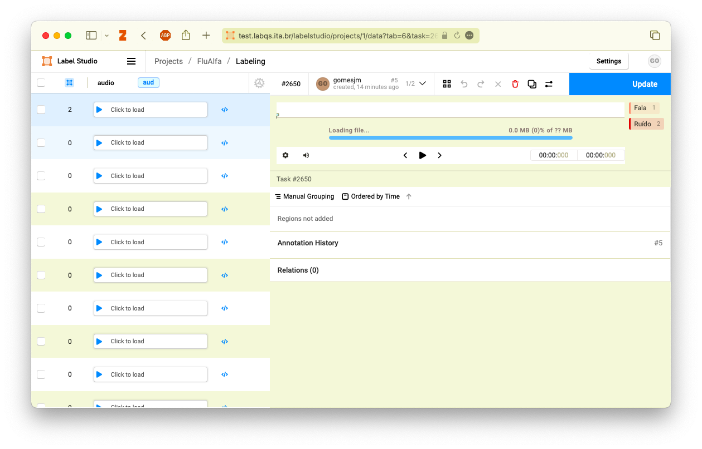

## Acesso aos de arquivos de coleta do FluAlfa

### Acessar Gerenciador de Armazenamento

Antes criar o usuário para acesso:

```sh
mc admin user svcacct st-test-maint labelstudio-rw

mc admin user svcacct add st-hom-maint labelstudio-rw
```

> **Obs**.: _Anotar os valores retornados_

Em seguida configurar o rotulador de dados:

Repositório de áudios (somente leitura):



Repositório para as rotulações (leitura/gravação):



Acesso à pasta:


