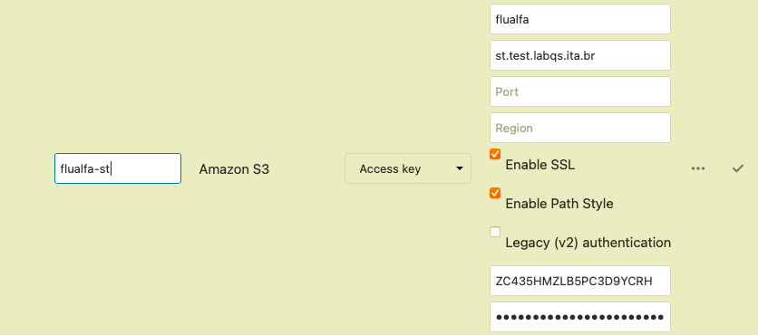
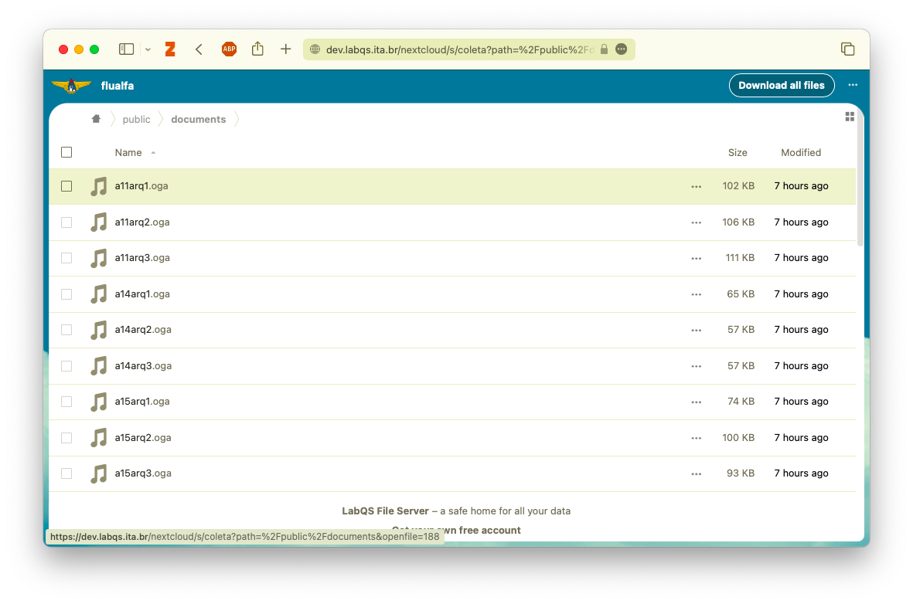

## Configurar repositórios

### Registrar super usuário 

```sh
mc alias set st-test-maint https://st.test.labqs.ita.br maint ::senha::
mc alias set st-hom-maint https://st.labqs.ita.br maint ::senha::
```

> **Obs**.: _para gerar senhas usamos o comando `openssl rand -hex 8`_

### Trace

```sh
mc admin trace st-test-maint
mc admin trace st-hom-maint
```

### Logs

```sh
mc admin logs st-test-maint
mc admin logs st-hom-maint
```

### Criar bucket

#### FluAlfa

```sh
mc mb st-test-maint/flualfa --with-versioning
mc mb st-hom-maint/flualfa --with-versioning
```

### Criar usuários

#### FluAlfa

```sh
mc admin user add st-test-maint flualfa-ro ::senha::
mc admin user add st-test-maint flualfa-rw ::senha::

mc admin user add st-hom-maint flualfa-ro ::senha::
mc admin user add st-hom-maint flualfa-rw ::senha::
```

#### Nextcloud

```sh
mc admin user add st-test-maint nextcloud-ro ::senha::
mc admin user add st-test-maint nextcloud-rw ::senha::

mc admin user add st-hom-maint nextcloud-ro ::senha::
mc admin user add st-hom-maint nextcloud-rw ::senha::
```


### Criar grupo

#### FluAlfa

```sh
mc admin group add st-test-maint flualfa-ro flualfa-ro
mc admin group add st-test-maint flualfa-rw flualfa-rw

mc admin group add st-hom-maint flualfa-ro flualfa-ro
mc admin group add st-hom-maint flualfa-rw flualfa-rw
```


#### Nextcloud

```sh
mc admin group add st-test-maint nextcloud-ro nextcloud-ro
mc admin group add st-test-maint nextcloud-rw nextcloud-rw

mc admin group add st-hom-maint nextcloud-ro nextcloud-ro
mc admin group add st-hom-maint nextcloud-rw nextcloud-rw
```

### Criar política

#### FluAlfa

Arquivo `flualfa-ro.policy.json`:

```json
{
    "Version": "2012-10-17",
    "Statement": [{
        "Effect": "Allow",
        "Action": [
            "s3:GetBucketLocation",
            "s3:GetObject",
            "s3:ListBucket"
        ],
        "Resource": [
            "arn:aws:s3:::flualfa/*"
        ]
    }]
}
```

Arquivo `flualfa-rw.policy.json`:

```json
{
    "Version": "2012-10-17",
    "Statement": [{
        "Effect": "Allow",
        "Action": [
            "s3:*"
        ],
        "Resource": [
            "arn:aws:s3:::flualfa/*"
        ]
    }]
}
```

### Associar _política_ ao _grupo_:

#### FluAlfa

```sh
mc admin policy create st-test-maint flualfa-ro ./flualfa-ro.policy.json && \
mc admin policy attach st-test-maint flualfa-ro --group flualfa-ro && \
mc admin policy create st-test-maint flualfa-rw ./flualfa-rw.policy.json && \
mc admin policy attach st-test-maint flualfa-rw --group flualfa-rw && \
mc admin policy create st-hom-maint flualfa-ro ./flualfa-ro.policy.json && \
mc admin policy attach st-hom-maint flualfa-ro --group flualfa-ro && \
mc admin policy create st-hom-maint flualfa-rw ./flualfa-rw.policy.json && \
mc admin policy attach st-hom-maint flualfa-rw --group flualfa-rw
```

Configuração em Nextcloud:



Acesso à pasta:


