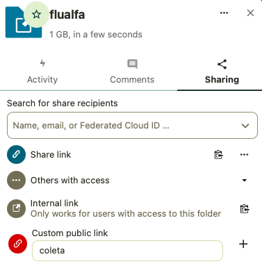

# Migração dos dados para gerenciador de armazenamento

```sh
cd . . . docker/volumes/flualfadata/_data/
mc cp --recursive documents/* st-test-maint/flualfa/public/documents
```


## Reindexar arquivos

```sh
docker exec -u www-data -it nextcloud bash
php occ files:scan --all
```

## Acesso aos de arquivos coletados

### Acessar Gerenciador de Armazenamento

Antes criar o usuário para acesso:

```sh
mc admin user svcacct add --access-key "ZC435HMZLB5PC3D9YCRH" --secret-key "m0qaRR4KD1Z+7pLwiWCv2x3l7xfqLpK3qpvb6j+K" st-test-maint flualfa-ro
```

Em seguida acessar o gerenciador:


Instalar aplicativo **Nextcloud** _Configurable Share Links_


Configurar o compartilhamento da pasta:



Acesso à pasta:


