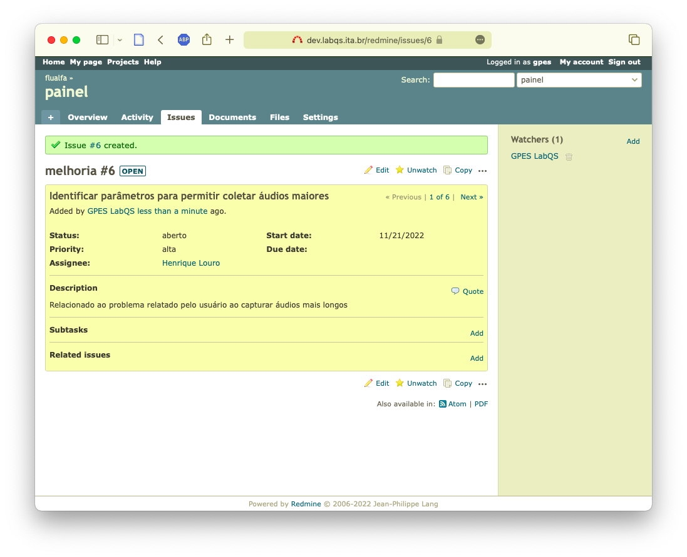

# Abertura de chamados no Redemine

## Tela inicial

Navegar até a lista de projetos (menu na barra superior):

## Lista de projetos

Na lista de projetos selecionar o projeto para o qual deseja relatar um problema ou solicitar uma melhoria:

Uma vez selecionado o projeto é apresentada a lista de tipos de relatos:

A opção "Issues" logo acima permite ver uma lista de relatos já feitos e em aberto (filtros para listar os relatos está logo acima):

A opção "New issue" permite inserir o problema (ou pedido de melhoria):

Inserir no formulário a maior quantidade possível de informações para auxiliar o relato de um problema. A forma ideal indica o problema de forma resumida no título ("Subject") e na descrição informa:

* Passos para reproduzir o problema com as informações que foram inseridas no aplicativo desde sua tela inicial, tais como identificação do usuário (não a senha), navegação até a tela que deu problema, etc.
* O problema ocorrido
* O resultado esperado

Caso saiba, o relato pode ser assinalado para alguém em particular e mais pessoas podem ser assinaladas para acompanharem.

> **Obs.:** É importante selecionar corretamente a **prioridade** (para o caso de relato de problemas).

O relato salvo:

Uma vez aberto, a pessoa que recebeu o relato poderá complementar com informações pertinentes:

Uma vez aberto o relato vai para a lista e a partir de então é possível fazer duas coisas:

* Com base nas informações adicionais, podemos reassinalar o relato para outra pessoa, ou
* Como no exemplo abaixo, criar um novo chamado para que outra pessoa tome providencias para resolver o problema

Aqui optamos por criar um novo relato para solicitar informações sobre possível solução para o primeiro problema:

Para manter o acompanhamento, foi criada uma relação entre os dois relatos

## Fluxo de trabalho

Na imagem abaixo podemos ver o fluxo de trabalho.

1. Um chamado é aberto pelo autor (_reporter_)
    1. A ocorrência é salva com situação **aberto**
    2. Caso deseje o autor pode mudar a situação para **fechado**
2. O desenvolvedor (_developer_) é notifidado
    1. Muda a situação para **análise** e inicia seu trabalho, ou
    2. Pode mudar a situação para **execução** diretamente, ou ainda
    3. Pode encerrar mudando para **fechado**
    4. Caso tenha optado seguir o fluxo de **análise**, **execução** poderá ao final encerrá-lo mudando para **fechado**
    
