# Sistema de Gestão de Projetos de Pesquisa

O objetivo deste portal é gerenciar atividades diversas de manutenção e proposta de melhorias para os sistemas de pesquisa sob o LabQS.

Após registro no portal, o usuário será aprovado por um administrador e após confirmação irá proceder para acessar o sistema:

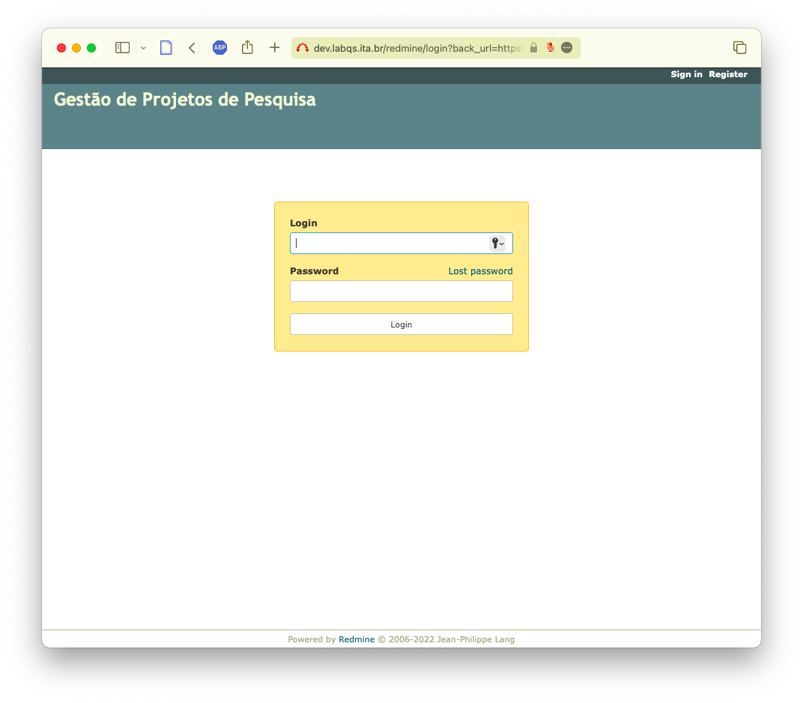
_Tela de login_

Uma vez no portal, o usuário poderá consultar em **Projetos** (_link na faixa superior da página_) os projetos sobre os quais poderá atuar.

> Obs.: Existem **projetos** e **sub-projetos**. Esta em geral lista **sub-projetos** subordinados à um projeto maior de pesquisa ou desenvolvimento.

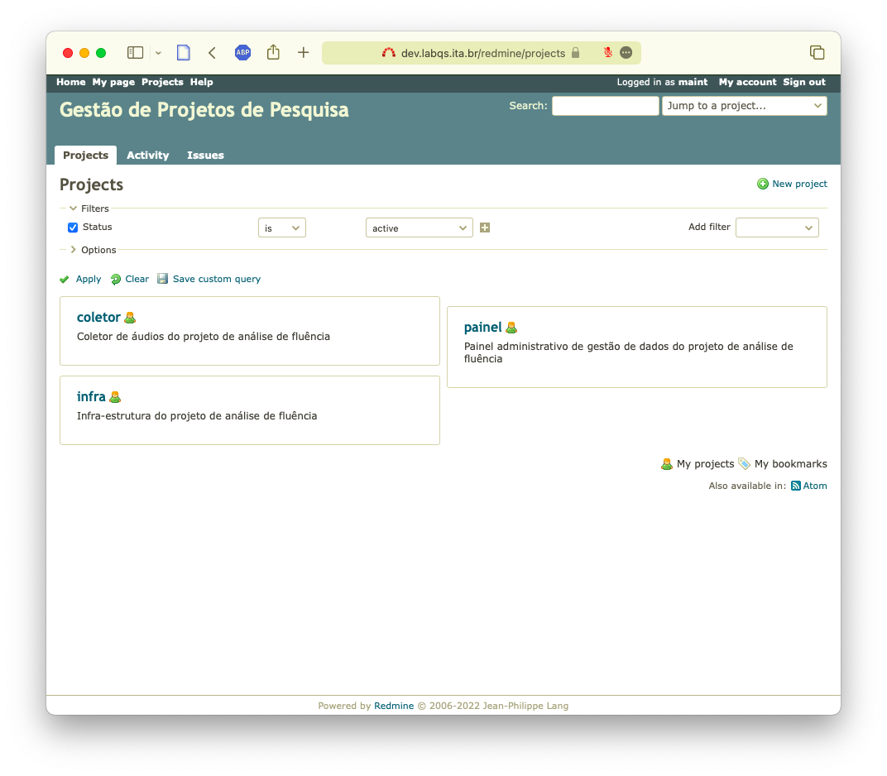
_Lista de projetos_

Na aba _Issues_ (ou _Tarefas_ em português) é possível ver (se houverem) uma lista de problemas ou pedidos de melhorias. São listados problemas abertos ou atribuídos ao próprio usuário:

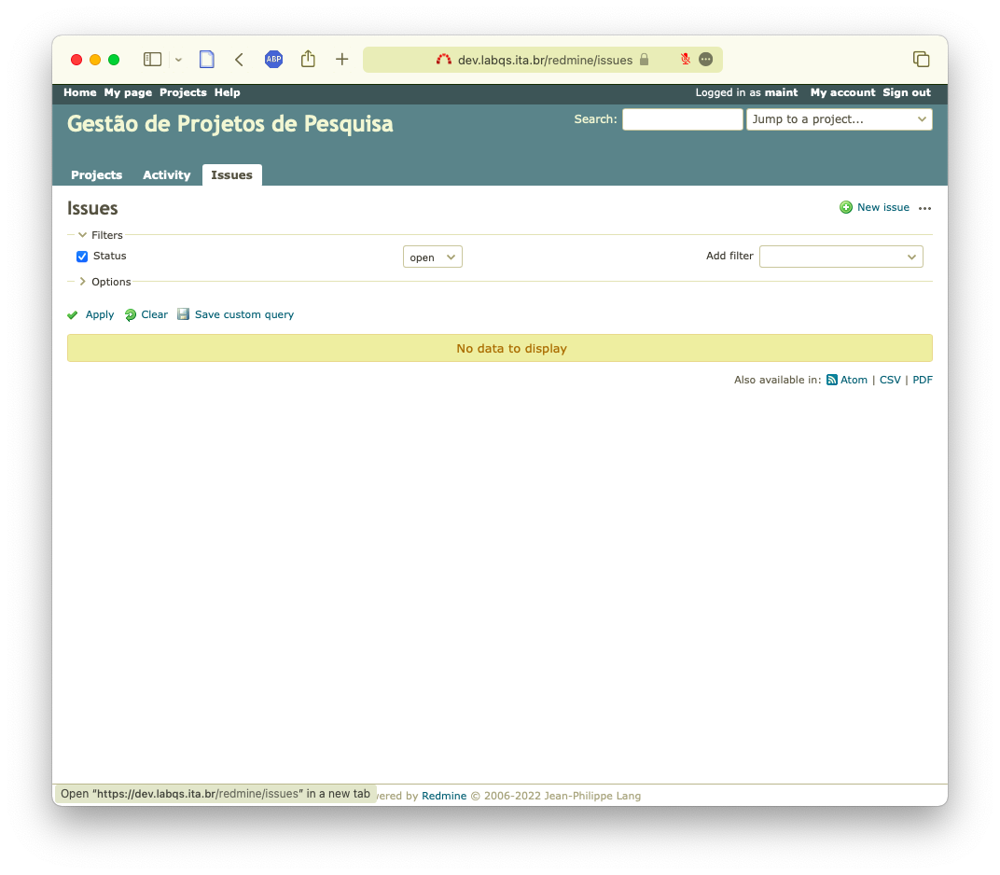
_Lista de tarefas_

A opção _New issue_ (ou _Nova tarefa_) no link à direita irá abrir a tela para criação de uma tarefa:

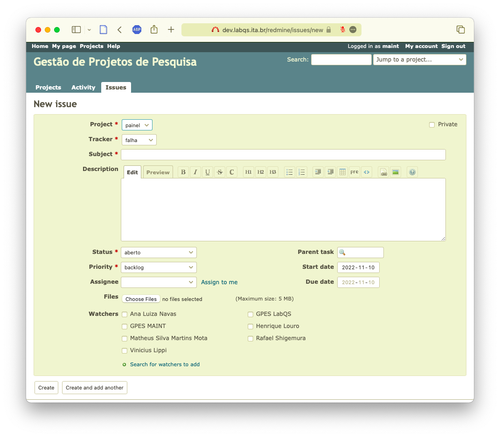
_Edição de tarefa_

Nesta tela é possível determinar o tipo de tarefa:

* **Falha** - qualquer ocorrência de um problema ou resultado inexperado de uma ação do usuário;
* **Melhoria** - sugestões ou pedidos de melhorias para uma operação.

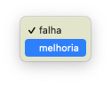
_Tipos de tarefas_

Também podemos indicar uma prioridade para a tarefa:

* **Alta** - Deve ser analisada imediatamente. A operação do projeto está prejudicada e não pode prosseguir;
* **Média** - Deve ser priorizada para a entrega atual ou no máximo para a próxima entrega;
* **Baixa** - É um problema que não causa impacto maior na operação do projeto mas deve ser corrigido assim que possível; e
* **Backlog** - Para **Melhorias** que devem ser planejadas no backlog do projeto.

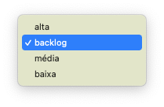
_Prioridade_

Finalmente é possível atribuir a tarefa à um desenvolvedor (ou o usuário pode atribuir à si próprio) que irá analisá-la, ou pode deixar em branco para ser atribuída pela própria equipe.

> Obs.: também é possível selecionar numa lista de múltipla escolha se desejamos que outros membros da equipe acompanhem o problema.

Uma vez aberto o problema é salvo e fica em análise.

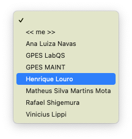
_Problema aberto_

Em seguida um pesquisador, ao acionar o sistema, terá em sua página as tarefas à ele atribuídas, além das que ele próprio abriu e das tarefas que ele está acompanhando.

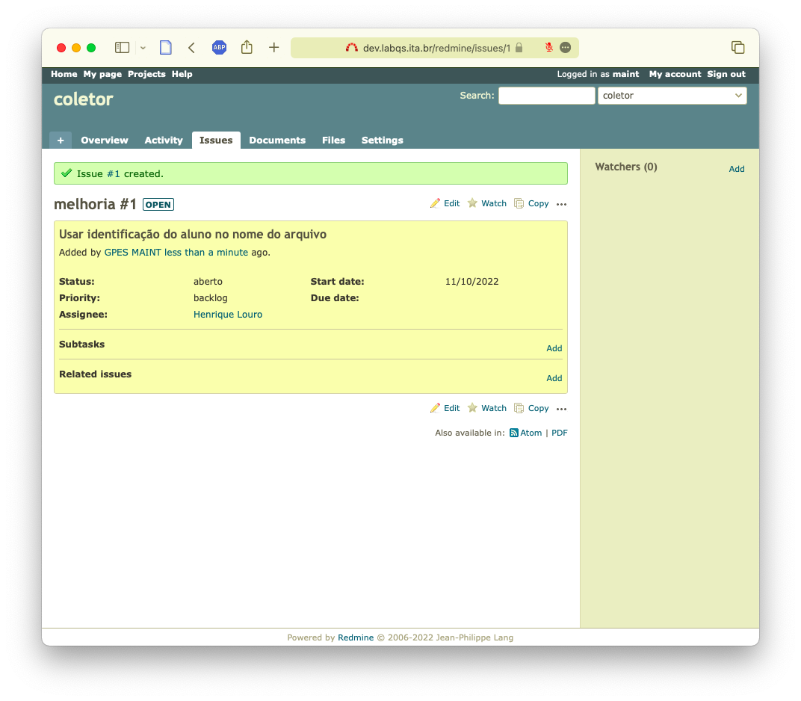
_Página de tarefas_

O pesquisador poderá abrir a tarefa, iniciar a análise, poderá inserir comentários e mudar o estado da tarefa.

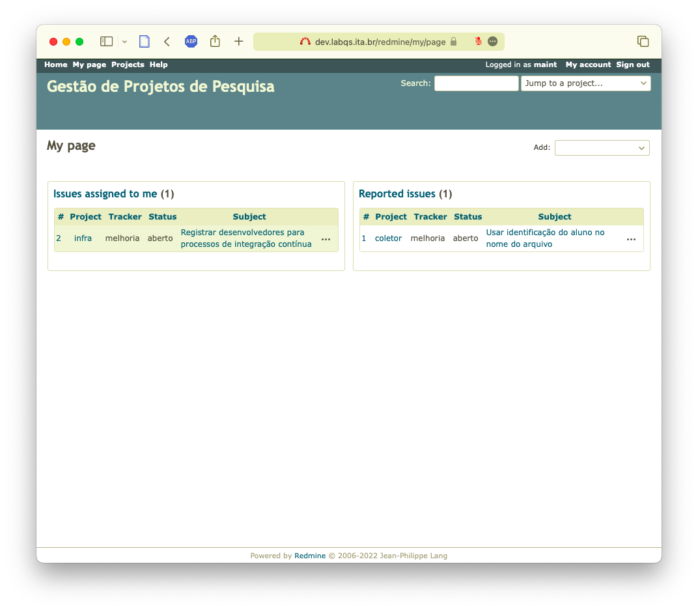
_Seleção da tarefa_

É possível inserir anotações para acompanhamento da tarefa:

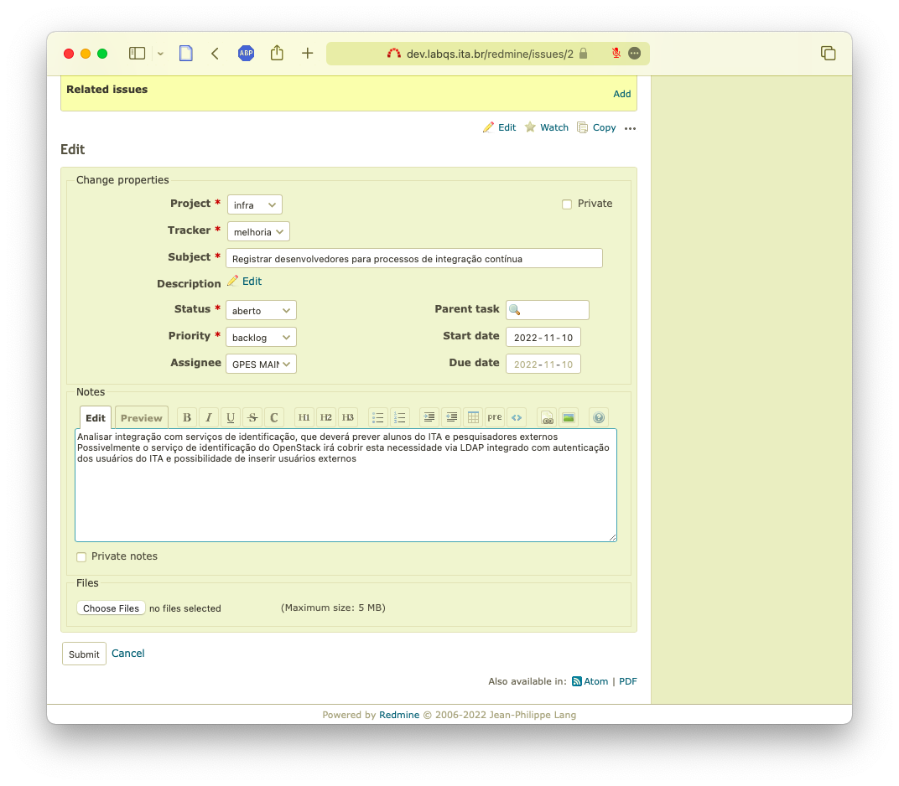
_Inserção de anotação_

Mudança do estado da terefa e seu posterior encerramento:

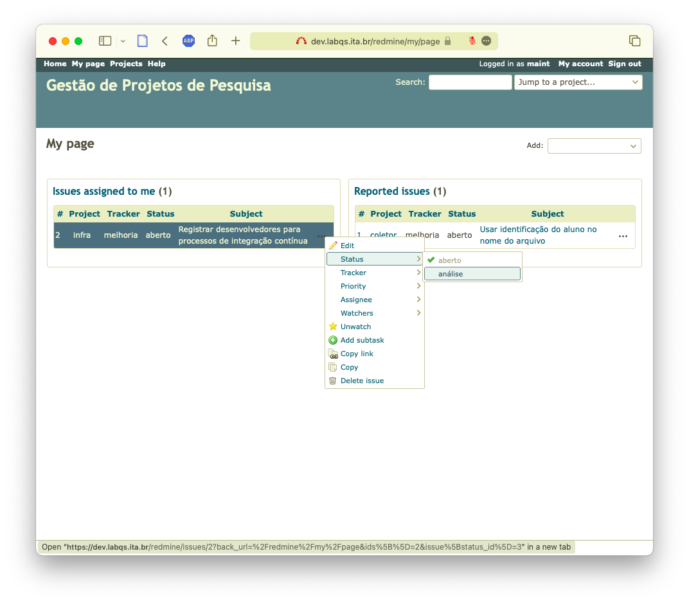
_Mudança de estado_

Ou mudança de prioridade:

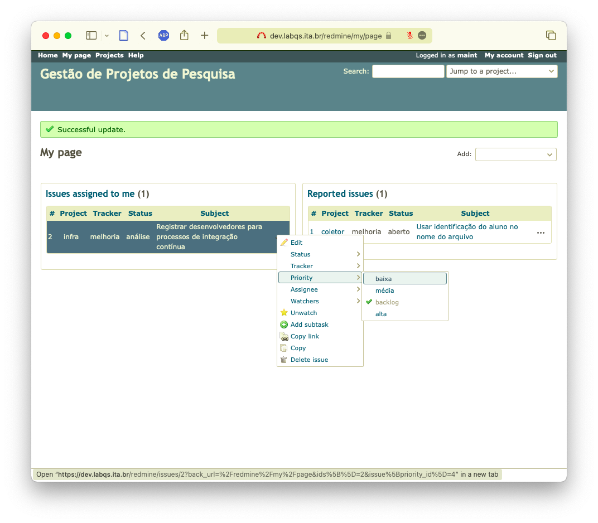
_Mudança de prioridade_

## Abertura de chamados

Em [ISSUES.md](./ISSUES.md) listamos os procedimentos para relatos de problemas ou solicitações de melhorias.

## Pendências ##

1. Integração com sistemas de autenticação de alunos e pesquisadores do ITA;
1. Integração e cadastro de pesquisadores convidados;
1. Integração com sistema de envio de mensagens por e-mail para notificação de pesquisadores e relatores.